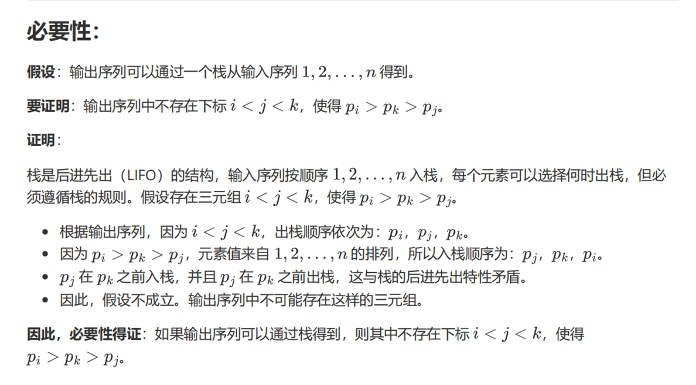
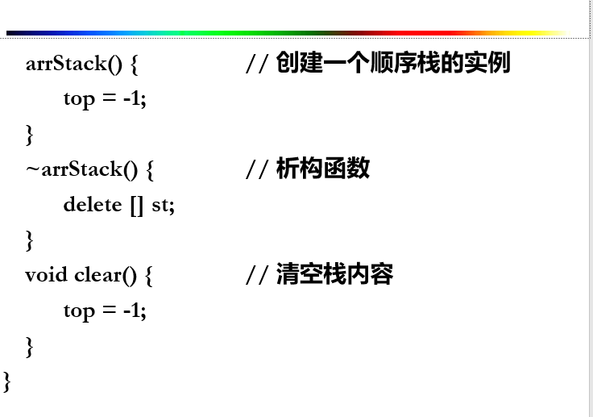
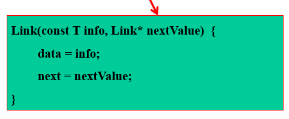
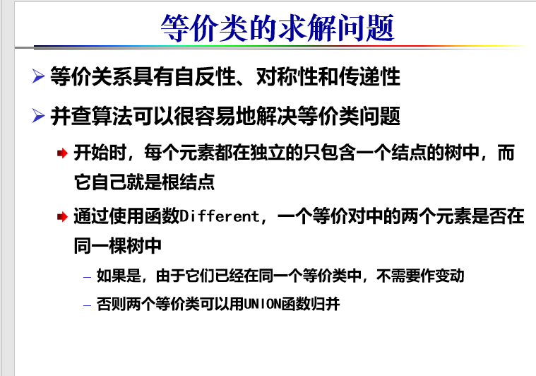

## 3. 考试范围和重点

1-6章，以本文最后的内容为复习重点，尤其是★标出部分为重中之重。考试时如果涉及到本大纲没有列出的内容，那么试卷中会给出足够的定义和性质。

# 遗留问题





# 第1章 概论 

一. 重要概念

1. 抽象数据结构 2. 数据逻辑结构 3.数据存储结构 4. 算法 ★ 5. 算法分析(时间代价、空间代价) 6. 数据结构的选择和评价 

二. 方法

1. 根据二元组画出图示逻辑结构(注意边的方向) 

 ★ 2. 根据要求设计数据结构
 ★ 3. 算法的渐进分析方法 
 ★ 4.算法分析的大O表示法（不要求掌握大Ω、大Θ表示法）

## 数据结构

- 涉及数据之间的**逻辑关系**，数据在计算机中的**存储表示**和在这种结构上的一组能执行的**操作（运算）**三个方面
- 三要素
  - 逻辑结构
  - 存储（物理）结构
  - 运算

### 逻辑结构

具体问题的数学抽象，反映事物的组成和逻辑关系

逻辑结构的表示：


### 存储结构


## 抽象数据类型

抽象数据类型由<数据对象、数据关系、数据操作>

三个不可分割的部分组成的三元组

ADT抽象数据类型名{

数据对象D：<数据对象的定义>

数据关系S： <数据关系的定义>

数据操作P：<基本操作的定义>

}ADT抽象数据类型名


## ==算法分析==

- 算法分析是对一个算法需要多少计算时间和存储时间作定量的分析
- 判断所提出的算法==是否符合现实情况==
- 时间和空间复杂性

### ==算法的渐进分析==

$$
f(n)=n^2+100n+log_{10}n+1000
$$

- 算法分析：估计当数据规模n逐步增大时，（时间或者空间）资源开销f(n)的增长规模
- 从数量级大小的比较来考虑，当n增大到一定值时，资源开销的计算公式中影响最大的就是n的幂次最高的项，其他的常数项和低幂次项均可忽略不计


### ==大O表示法==


### 二分查找法时间复杂度推导

二分查找法（Binary Search）是一种高效的查找算法，适用于**已排序**的数组或列表。它通过反复将查找范围缩小一半来快速定位目标元素。其时间复杂度为 \( O(\log n) \)。下面将详细推导二分查找法的时间复杂度。

#### 一、二分查找法的基本原理

假设有一个**升序**排列的数组 \( A \) ，包含 \( n \) 个元素。目标是查找某个特定的元素 \( x \) 是否存在于数组中，并找到其位置。二分查找的步骤如下：

1. **确定查找范围**：初始时，查找范围为整个数组，即从下标 \($$ \text{low} = 0$$ \) 到 \($$ \text{high} = n-1$$ \)。
2. **找到中间元素**：计算中间下标 

$$
\text{mid} = \left\lfloor \frac{\text{low} + \text{high}}{2} \right\rfloor
$$

然后比较 \( $$A[\text{mid}]$$ \) 与 \( x \)：
   - 如果 \( $$A[\text{mid}] = x )，查找成功，返回 ( \text{mid} )$$。
   - 如果 \( $$A[\text{mid}] < x $$\)，则目标元素 \( x \) 只能在右半部分，即更新查找范围为 \( $$\text{low} = \text{mid} + 1$$ \) 到 \($$ \text{high}$$ \)。
   - 如果 \( $$A[\text{mid}] > x$$ \)，则目标元素 \( x \) 只能在左半部分，即更新查找范围为 \( $$\text{low} $$) 到 \( $$\text{mid} - 1$$ \)。
3. **重复步骤2**，直到找到目标元素或查找范围为空。

#### 二、时间复杂度的推导

##### 1. 每一步缩小查找范围的大小

在每一步操作中，二分查找法将当前的查找范围缩小一半。这意味着：

- 初始时，查找范围大小为 \( n \)。
- 第一次比较后，查找范围缩小到 

$$
\frac{n}{2}
$$

- 第二次比较后，查找范围缩小到 

$$
\frac{n}{4}
$$

- 第 \( k \) 次比较后，查找范围缩小到 

$$
\frac{n}{2^k}
$$

##### 2. 确定最坏情况下需要的比较次数

最坏情况下，二分查找需要继续缩小查找范围，直到查找范围大小为1，即：

$$
\frac{n}{2^k} \leq 1
$$

解这个不等式：

$$
n \leq 2^k \\
\Rightarrow \log_2 n \leq k
$$

因此，最坏情况下需要的比较次数 \( k \) 至少为 

$$
\log_2 n
$$

##### 3. 递归关系的推导

可以通过递归关系进一步确认时间复杂度。

设 \( T(n) \) 为在大小为 \( n \) 的数组上进行二分查找的时间复杂度。根据二分查找的步骤，每次比较后将问题规模缩小一半，并进行常数时间的比较操作。因此递归关系为：

$$
T(n) = T\left(\frac{n}{2}\right) + c
$$

其中，\( c \) 是常数时间（比较操作）的时间。

通过递归展开：

$$
T(n) = T\left(\frac{n}{2}\right) + c \\
= T\left(\frac{n}{4}\right) + 2c \\
= T\left(\frac{n}{8}\right) + 3c \\
\vdots \\
= T\left(\frac{n}{2^k}\right) + kc
$$

当 

$$
\frac{n}{2^k} = 1
$$

即 \( k = \log_2 n \) 时，递归终止：

$$
T(n) = T(1) + c \log_2 n
$$

由于 \( T(1) \) 是常数，最终时间复杂度为：

$$
T(n) = O(\log n)
$$

##### 4. 示例说明

假设有一个大小为 \( n = 16 \) 的数组，进行二分查找的步骤如下：

1. **第一次比较**：查找范围 \( 16 \) 个元素，比较中间的第 \( 8 \) 个元素。
2. **第二次比较**：查找范围缩小到 \( 8 \) 个元素，比较中间的第 \( 4 \) 个元素。
3. **第三次比较**：查找范围缩小到 \( 4 \) 个元素，比较中间的第 \( 2 \) 个元素。
4. **第四次比较**：查找范围缩小到 \( 2 \) 个元素，比较中间的第 \( 1 \) 个元素。
5. **第五次比较**：查找范围缩小到 \( 1 \) 个元素，比较最终元素。

可以看到，比较次数为 

$$
\log_2 16 = 4
$$

对于一般情况，大小为 \( n \) 的数组，最多需要 

$$
\log_2 n
$$

次比较。

#### 三、结论

二分查找法通过每次将查找范围缩小一半，使得其时间复杂度为对数级别，即 

$$
O(\log n)
$$

这种高效的查找性能使得二分查找在处理大规模已排序数据时非常有用。

# 第2章 线性表

一. 概念

1. 线性表 2. 单链表 3. 双链表 4. 循环表

二. 方法

1. 顺序表上实现的运算

 ★ 2.链表上实现的运算(指针操作的正确性) 

3. 顺序表和链表的比较

## 链表

==插入和删除要注意边界==

链表检索


**链表插入**

```c
ListNode* Insert(int i,T value){
    ListNode *p,*q;
    q=new ListNode;
    p=setPos(i-1);
    if(p==NULL)return false;
    q->data=value;
    q->next=p->next;
    p->next=q;
    if(q->next==NULL)
        tail=q;
   	return true;
}
```

**链表删除**

```c
template<class T>
bool lnkList<T>::delete(const int i){
    Link<T>*p,*d;
    if((p=setPos(i-1))==NULL||p==tail){
        cout<<"非法删除点"<<endl;
        return false;
    }
    d=p->next;
    if(d=tail){
        tail=p;
        p->next=NULL;
        delete d;
    }
    else{
        p->next=d->next;
        delete d;
        
    }
    return true;
}
```

## 线性表实现方法的比较

- 顺序表的主要优点
  - 没有使用指针，不用花费额外开销
  - 线性表元素的访问非常便利
- 链表的主要优点
  - 无需事先了解线性表的长度‘
  - 允许线性表的长度动态变化
  - 能够适应经常插入删除内部元素的情况
- 顺序表适合存储静态数据，链表适合动态数据


# 第3章 栈与队列

一. 概念

1. 栈 2. 队列 3. 循环队列

二. 方法

★ 1. 栈的性质，用栈来生成序列，栈的实现

2. 队列的性质，用队列生成序列 

 ★3. 循环队列的实现
 ★ 4. **利用栈来消除递归**

5. 栈的灵活应用，例如表达式求值 (中缀表达式转后缀表达式的算法、后缀表达式求值算法) 

## ==栈的性质==

- 先进后出

### ==栈的实现==

### 栈的ADT

```cpp
template <class T>  // 栈的元素类型为 T
class Stack {

public:  // 栈的运算集

    void clear();  // 变为空栈

    bool push(const T item);  // item入栈, 成功则返回真, 否则返回假

    bool pop(T &item);  // 返回栈顶内容并弹出, 成功返回真, 否则返回假

    bool top(T &item);  // 返回栈顶内容但不弹出, 成功返回真, 否则返回假

    bool isEmpty();  // 若栈已空返回真

    bool isFull();  // 若栈已满返回真
};

```


### 顺序栈





#### 溢出

- 上溢(overflow)
  - 当栈中已经有maxsize个元素时，如果再做进栈操作，所产生的"无空间可用"现象
- 下溢（underflow）
  - 空栈进行出栈所产生的“无元素可删”现象


### 链式栈

- 栈的链式存储结构，是运算受限的链表
- 指针方向：==从栈顶向栈底==
- 只能在链表头部进行操作，==故链表没有必要像单链表那样附加头结点。==
- 栈顶指针就是链表的头指针（top）
- 无栈满问题（但存在栈空约束）

#### 链式栈的创建


压栈



```cpp
bool InkStack<T>::push(const T item){
    //创建一个新节点，并使其next域赋值top
    Link<T>* tmp=new Link<T>(item,top)
    top = tmp;
    size++;
    return true;
}
```

弹栈

```cpp
bool InkStack<T>::pop(T& item){
    Link<T>*tmp;
    if(size==0){
        cout<<"栈为空，不能执行出栈操作"<<endl;
        return false;
    }
    item =top->data;
    tmp= top->next;
    delete top;
    top =tmp;
    size--;
    return true;
}
```


### 两者比较


## ==利用栈来消除递归==


#### 简单的递归转换

阶乘递归实现

```cpp
long factorial(long n){
    if(n<=0)
        return 1;
    return n*factorial(n-1);
}
```


阶乘非递归实现

```cpp
long factorial(long n){
    long m=1;
    for(long i=1;i<=n;i++){
        m=m*i;
    }
    return m;
}
```


#### ==尾递归==

- 指函数的最后一个动作时调用函数本身的递归函数，是递归的一种特殊情形
- 尾递归的本质是：将单词计算的结果缓存起来，传递给下次调用，相当于自动累积

```cpp
int factorial_tail(int n, int acc = 1) {
    if (n == 1) {
        return acc;
    }
    return factorial_tail(n - 1, n * acc);  // 尾递归，递归调用直接返回
}
```

#### ==机械的递归转换==

方法步骤：

- 设置一工作栈保存当前工作记录
- 设置t+2个语句标志
- 增加非递归入口
- 替换第i（i=1,...,t）个递归规则
- 所有递归出口处增加语句:goto label t+1;
- 标号为t+1的语句的格式
- 改写循环和嵌套中的递归
- 优化处理

- [简化的0-1背包问题]

​	我们有n件物品，物品i的重量为`w[i]`。如果限定每种物品：要么完全放进背包，要么不放进背包，即物品是不可分割的。

​	问：能否从这n件物品中选择若干件放入背包，使其重量之和恰好为s

##### 我们来看递归版本

递归关系
$$
knap(s,n)=\begin{cases}true,当s=0\\
false,当s<0或s>0且n<1\\
knap(s-w[n-1],n-1)||knap(s,n-1),当s>0且n>=1 (两种情况，是否取最后一项)

\end{cases}
$$


```cpp
bool knap(int s,int n){
    if(s==0){
        return true;
    }
    else if(s<0||(s>0&&n<1)){
        return false;
    }
    if(knap(s-w[n-1],n-1)){
        cout<<w[n-1];
        return true;
    }
    else{
        return knap(s,n-1);
    }
}
```


- 1.设置一工作栈保存当前工作记录
  - 在函数中出现的所有参数和局部变量都必须用栈中的数据成员代替
    - 返回情况标号
    - 函数参数（值参、引用型）
    - 局部变量

```cpp
enum rdType{0,1,2};//对应三种情况
public class knapNode{
    int s,n;//背包容量和物品数目
    rdType rd;//返回情况标号
    bool k;//结果单元
};
```


- 2.设置 t+2个语句标号
  - label 0:第一个可执行语句
  - label t+1:设置在函数题结束处
  - label i(1<=i<=t):第i个递归返回处


- 3.增加非递归入口

```cpp
//将第一个数据成员（递归起点）压入栈
Stack<knapNode>stack;
knapNode tmp;
tmp.s=s;tmp.n=n;tmp.rd=0;
stack.push_back(tmp)
```

- 4.替换第i（i=1,...,t）个递归规则


- 5.所有递归出口处增加语句
  - 递归出口增加跳转语句，以进行递归结束后的相关处理
    - goto label t+1;
- 6.标号为t+1的语句
  - 标号为t+1的语句形如

```cpp
stack.pop(&tmp);
switch(tmp.rd){
    case 0:return ;
    case 1:goto label1;break;
    //......
    case t:goto labelt ;break;
    default: break;
}
```

- 7.改写循环和嵌套中的递归


- 结果

```cpp

enum rdType{0,1,2};//对应三种情况
public class knapNode{
    int s,n;//背包容量和物品数目
    rdType rd;//返回情况标号
    bool k;//结果单元
};
bool nonRecKnap(int s,int n){
    //将第一个数据成员（递归起点）压入栈
Stack<knapNode>stack;
knapNode tmp;
tmp.s=s;tmp.n=n;tmp.rd=0;
stack.push_back(tmp)
label 0:
	stack.pop(&tmp);
	if(tmp.s==0){
	tmp.k=true;
	goto label3;
	}
	if((tmp.s<0)||(tmp.s>0&&tmp.n<1)){
        tmp.k=false;
        goto label3;
    }
    stack.push(tmp);//没有满足出口条件
    x.s=tmp.s-w[tmp.n-1];
    x.n=tmp.n-1;
    x.rd=1;
    stack.push(x);
    goto label0;
    label1:
    stack.pop(&x);//查看栈顶并分情况处理
    if(tmp.k==true){
        x.k=true;
        stack.push(x);
        cout<<w[x.n-1]<<endl;//输出物品
        goto label3;
    }
    stack.push(x);//某层结果单元为false
    tmp.s=x.s;tmp.n=x.n-1;tmp.rd=2;
    stack.push(tmp);//回溯
    goto label0;
    label2:
    stack.pop(&x);
    x.k=tmp.k;//结果单元上传给调用层
    stack.push(x);
    label3:
    stack.pop(&tmp);
    switch(tmp.rd){
        case 0:return tmp.k;//算法结束
        case 1:goto label1;
        case 2:goto label2;
    }
}
```

## ==合法出栈序列==

- 给定一个入栈序列s(string 类型)，要求输出一个result(vector<string>类型),result中存储着s的所有合法出栈序列

```cpp
#include <iostream>
#include <vector>
#include <string>
#include <stack>

using namespace std;

class Solution {
public:
    vector<string> generatePopSequences(const string& s) {
        vector<string> result;
        string current;
        stack<char> stk;
        backtrack(s, 0, stk, current, result);
        return result;
    }

private:
    void backtrack(const string& s, int index, stack<char>& stk, string& current, vector<string>& result) {
        // 如果所有元素都已处理且栈为空，则当前序列是一个合法的出栈序列
        if (index == s.size() && stk.empty()) {
            result.push_back(current);
            return;
        }

        // 如果还有元素未入栈，可以选择入栈
        if (index < s.size()) {
            // 选择入栈
            stk.push(s[index]);
            backtrack(s, index + 1, stk, current, result);
            stk.pop(); // 回溯，撤销入栈操作
        }

        // 如果栈不为空，可以选择出栈
        if (!stk.empty()) {
            char top = stk.top();
            stk.pop();
            current += top;
            backtrack(s, index, stk, current, result);
            current.pop(); // 回溯，撤销出栈操作
            stk.push(top); // 恢复栈状态
        }
    }
};

// 示例使用
int main() {
    Solution solution;
    string s = "ABC";
    vector<string> sequences = solution.generatePopSequences(s);

    cout << "所有合法的出栈序列为：" << endl;
    for (const auto& seq : sequences) {
        cout << seq << endl;
    }

    return 0;
}

```


- 给定一个入栈序列，一个出栈序列，写一个程序，判断出栈序列是否合法（chatgpt o1生成）

  ```cpp
  #include <iostream>
  #include <stack>
  #include <vector>
  #include <unordered_set>
  
  using namespace std;
  
  // 函数声明
  bool isValidPopSequence(const vector<int>& pushSeq, const vector<int>& popSeq);
  
  int main() {
      int n;
      cout << "请输入序列的长度 n: ";
      cin >> n;
  
      vector<int> pushSeq(n);
      vector<int> popSeq(n);
  
      cout << "请输入入栈序列（用空格分隔）: ";
      for(int i = 0; i < n; ++i) {
          cin >> pushSeq[i];
      }
  
      cout << "请输入出栈序列（用空格分隔）: ";
      for(int i = 0; i < n; ++i) {
          cin >> popSeq[i];
      }
  
      // 检查输入序列是否包含相同的元素
      unordered_set<int> pushSet(pushSeq.begin(), pushSeq.end());
      unordered_set<int> popSet(popSeq.begin(), popSeq.end());
  
      if(pushSet != popSet){
          cout << "入栈序列和出栈序列的元素不一致，无法比较。" << endl;
          return 0;
      }
  
      if(isValidPopSequence(pushSeq, popSeq)){
          cout << "出栈序列是合法的。" << endl;
      }
      else{
          cout << "出栈序列是不合法的。" << endl;
      }
  
      return 0;
  }
  
  bool isValidPopSequence(const vector<int>& pushSeq, const vector<int>& popSeq){
      stack<int> s;
      int popIndex = 0;
      int n = pushSeq.size();
  
      for(int i = 0; i < n; ++i){
          // 将当前入栈元素压入栈中
          s.push(pushSeq[i]);
  
          // 检查栈顶元素是否与当前出栈元素匹配
          while(!s.empty() && s.top() == popSeq[popIndex]){
              s.pop();
              popIndex++;
          }
      }
  
      // 如果所有出栈元素都匹配完，且栈为空，则合法
      return s.empty();
  }
  
  ```

- 给定一个入栈序列，序列长度为N，请计算由多少种出栈序列

卡特兰数:$$\frac{1}{n+1} \binom{2n}{n} $$

其表示从(0,0)到(n,n)不穿过对角线的路径数

那么我们可以将栈的出栈序列这样抽象化，我们知道，在栈未完全弹出前，出栈的次数一定小于等于入栈的次数，我们将入栈看做(x,y)到(x+1,y)，出栈看做(x,y)到(x,y+1)，每一个路径都对应于一个出栈序列，那么我们可以知道，该路径肯定不会穿过对角线，因为栈的次数一定小于等于入栈的次数。则出栈序列个数就是卡特兰数

## 队列


### 队列的ADT


### ==循环队列==

#### 实现

入队：

arr[rear]=item;

rear=(rear+1)%mSize;

出队：

item=arr[front];

front=(front+1)%mSize;

判断队满:

(rear+1)%mSize==front;

判断队空

front==rear

### 链式队列


## 作业题


**证明：**

**必要性（若输出序列可由栈操作得到，则不存在 \(i < j < k\)，使得 \(p_i > p_k > p_j\)：**

假设输出序列 \(p_1, p_2, \dots, p_n\) 可以通过栈操作得到。我们要证明在该序列中不存在下标 \(i < j < k\)，使得 \(p_i > p_k > p_j\)。

假设反设，存在 \(i < j < k\)，使得 \(p_i > p_k > p_j\)。考虑栈操作过程中的这三个元素：

1. **元素 \(p_i\) 的出栈：** 在位置 \(i\)，元素 \(p_i\) 被弹出栈。这意味着在此之前，元素 \(1\) 到 \(p_i\) 已经被压入栈或弹出。

2. **元素 \(p_j\) 的出栈：** 在位置 \(j\)，元素 \(p_j\) 被弹出栈。由于 \(p_j\) 在 \(p_i\) 之后被弹出，且 \(i < j\)，因此 \(p_j\) 必须在 \(p_i\) 被弹出后仍留在栈中。这意味着 \(p_j\) 在 \(p_i\) 之前被压入栈，但在 \(p_i\) 被弹出后才被弹出。

3. **元素 \(p_k\) 的出栈：** 在位置 \(k\)，元素 \(p_k\) 被弹出栈。由于 \(p_k\) 介于 \(p_i\) 和 \(p_j\) 之间，且 \(p_i > p_k > p_j\)，这意味着在 \(p_i\) 被弹出后，\(p_k\) 被压入栈，并在 \(p_j\) 被弹出前被弹出。

然而，这与栈的后进先出性质矛盾。因为 \(p_j\) 在 \(p_i\) 之前被压入栈，但在 \(p_k\) 之后被弹出，这不符合栈的操作规则。因此，假设不成立，输出序列中不存在这样的 \(i, j, k\)。

**充分性（若输出序列中不存在 \(i < j < k\)，使得 \(p_i > p_k > p_j\)，则可以通过栈操作得到该序列）：**

我们将构造一个栈操作序列，使得输入序列 \(1, 2, \dots, n\) 可以通过栈操作得到输出序列 \(p_1, p_2, \dots, p_n\)。

**算法步骤：**

1. **初始化：** 设栈为空，输入指针指向 \(1\)，输出指针指向 \(p_1\)。

2. **循环操作：**
   - **步骤 A：** 若栈顶元素等于当前输出指针指向的元素 \(p_j\)，则弹出栈顶元素，并将输出指针移动到下一个元素。
   - **步骤 B：** 否则，若输入指针未超过 \(n\)，则将输入指针指向的元素压入栈，并将输入指针移动到下一个元素。
   - **步骤 C：** 若输入指针已超过 \(n\)，但栈顶元素不等于 \(p_j\)，则算法失败，无法生成输出序列。

3. **结束条件：** 当输出指针超过 \(n\) 时，算法成功。

**证明算法的正确性：**

- **栈的单调性：** 在任何时刻，栈中的元素都是严格递减的。这是因为只有当栈顶元素等于当前需要输出的元素时才会弹出，否则只会压入更大的元素。

- **避免 \(p_i > p_k > p_j\) 的情况：** 由于序列中不存在 \(p_i > p_k > p_j\) 且 \(i < j < k\)，所以在上述算法中，不会遇到无法弹出栈顶元素且无法继续压栈的矛盾情况。

因此，该算法能够成功地将输入序列通过栈操作得到输出序列 \(p_1, p_2, \dots, p_n\)。

**结论：** 从初始输入序列 \(1, 2, \dots, n\)，可以利用一个栈得到输出序列 \(p_1, p_2, \dots, p_n\) 的充分必要条件是：输出序列中不存在下标 \(i < j < k\)，使得 \(p_i > p_k > p_j\)。


# 第4章 字符串

一. 概念

1. 串 2. 模式匹配

二. 方法

1. 串的基本操作
2. 串的存储及运算

 ★ 3. **串的KMP快速模式匹配算法，求特征向量数组（N数组）和利用N向量完成匹配的方法（注意变种KMP算法的特征定义、特征向量和KMP算法在字符串相关问题中的灵活应用）**


## 串的KMP快速模式匹配算法


非优化的算法:（就是简单的最大的公共前后缀的长度）

```cpp
int* findNext(string p){
    int i,k;
    int m=P.length();	//m为模板P的长度
    int* next=new int[m];//动态存储区开辟整数数组
    next[0]=-1;
    i=0;k=-1;
    while(i<m-1){
        //如果P[i]!=P[k],那么我们把k=next[k]，前面已经分析过，一直循环直到条件不满足
        while(k>=0&&P[k]!=P[i]){
            k=next[k];//k递归地向前找
        }
        i++;k++;//找到相等的了，即P[i]==P[k]了，那么next[i+1]=k+1了
        next[i]=k;
    }
    return next;
}
```


- 当P[i]==P[k]时，考虑我们在比较P和T时，既然P[i]已经和T[j]不匹配了，我们回溯到P[k]，还是不匹配地，不如直接回溯到next[k]

因此，回溯算法是

```cpp
int* findNext(string P){
    int i,k;
    int m=P.length();
    int *next=new int[m];
    next[0]=-1;
    i=0;k=-1;
    while(i<m-1){
        while(k>=0&&P[k]!=P[i]){
            k=next[k];
        }
        i++;k++;
        if(P[k]==P[i]){
            next[i]=next[k];
        }
        else{
            next[i]=k;
        }
    }
    return next;
}

```

==KMP模式匹配算法的==

```cpp
int KMPStrMatching(string T,string P,int *N,int start){
    N=findNext(P);
    int i=0;	//模式的下标变量
    int j=start;   //目标的下标变量
    int pLen=P.length(); //模式的长度
    int tLen=T.length(); //目标的长度
    if(tLen-start<pLen){//若目标比模式段，匹配无法成功
        return -1;
    }
    while(i<pLen&&j<tLen){//反复比较对应字符来开始匹配
        if(i==-1||T[j]==P[i]){
            i++,j++;
        }
        else{
            i=N[i];
        }
        
    }
    if(i>=pLen){
        return (j-pLen+1);
    }
    else return -1;
}
```

### 算法复杂度分析

先看求next的数组的复杂度

我们注意到在while循环中i只增不减，因此时间复杂度为O(m)

对于KMP匹配，我们又注意到在while循环中j只增不减

因此KMP算法的时间复杂度是O(n+m)


# 第5章 二叉树

一. 概念

1. 二叉树 2.二叉树的深度优先遍历 3. 二叉搜索树BST 4. 堆 5. Huffman树、Huffman编码 

二. 方法

1．二叉树的链式存储（1）二叉链表（2）带父指针的三重链表

2. 二叉树的顺序存储、完全二叉树的顺序存储

 ★ 3. 二叉树的深度优先遍历。要求自己能用**递归解决二叉树应用问题**；看得懂非递归二叉树遍历框架、**可以完成采用非递归算法设计的算法填空**

4. **二叉树的广度优先遍历及其应用**

 ★ 5. **二叉搜索树**的插入与删除
 ★ 6. 构造**Huffman树**，利用Huffman树进行编码、解码
 ★ 7. **堆**的建立与维护过程

## 思考题

==部分题在手写笔记上==

- N个节点的二叉树有多少种不同的形态？
- 是一个Catalan数，即，$$\frac{1}{n+1}\binom{2n}{n}$$

考虑其递归即可

## 定义

### 满二叉树

如果一棵二叉树的结点，或为树叶（0度节点），或为两颗非空子树（2度节点），则称作满二叉树


### 完全二叉树


==完全二叉树的特点==

- 叶节点只可能在最下面两层出现
- 路径长度和最短（满二叉树不具有此性质）

## 扩充二叉树


### 重要性质


## ==二叉树的周游==


```cpp
template<class T>
void BinaryTree<T>::DepthOrder(BinaryTreeNode<T>* root){
    if(root!=NULL){
        Visit(root);	//放这的时候是前序
        DepthOrder(root->leftchild()); //递归访问左子树
        Visit(root);	//放这的时候是中序
        DepthOrder(root->rightchild()); //递归访问右子树
        Visit(root); //后序
    }
}
```


```cpp
#include<iostream> // 引入输入输出流库
#include<vector> // 引入向量库
using namespace std; // 使用标准命名空间

vector<int> result; // 声明一个全局向量，用于存储结果

// 深度优先搜索函数，接受中序遍历和后序遍历的向量
void dfs(vector<int>middle,vector<int>post){
    // 如果中序数组的大小为0，说明没有节点，直接返回
    if(middle.size()==0){
        return;
    }
    // 如果中序数组的大小为1，说明只有一个节点
    if(middle.size()==1){
        result.push_back(middle[0]); // 将该节点添加到结果中
        return;
    }
    // 将后序数组的最后一个元素作为根节点添加到结果中
    result.push_back(post[post.size() - 1]); // 根节点

    int pos = 0; // 用于存储根节点在中序数组中的位置
    // 遍历中序数组，找到根节点的位置
    for (int i = 0; i < middle.size();i++){
        if(middle[i]==post[post.size() - 1]){
            pos = i; // 找到位置，记录下来
        }
    }
    // 切分中序数组为左子树和右子树
    vector<int> middle_pre(middle.begin(), middle.begin() + pos); // 左子树
    vector<int> middle_next(middle.begin() + pos + 1, middle.end()); // 右子树
    
    // 切分后序数组为左子树和右子树
    vector<int>post_pre(post.begin(), post.begin() + pos); // 左子树
    vector<int>post_next(post.begin() + pos, post.end() - 1); // 右子树
    
    // 递归处理左子树
    dfs(middle_pre, post_pre);
    // 递归处理右子树
    dfs(middle_next, post_next);
    
    return; // 返回
}

int main(){
    vector<int> num; // 声明一个向量用于存储输入的数字
    int i; // 定义一个整型变量用于接收输入
    // 从标准输入中读取数字，直到输入结束
    while(cin>>i){
        num.push_back(i); // 将输入的数字添加到向量num中
    }
    
    vector<int> middle; // 声明一个向量用于存储中序数组
    vector<int> post; // 声明一个向量用于存储后序数组
    
    // 将num数组的前一半添加到middle数组中
    for(int i=0;i<num.size()/2;i++){
        middle.push_back(num[i]); // 将前一半的元素添加到middle中
    }
    
    // 将num数组的后一半添加到post数组中
    for(int i=num.size()/2;i<num.size();i++){
        post.push_back(num[i]); // 将后一半的元素添加到post中
    }
    
    // 调用深度优先搜索函数
    dfs(middle, post);
    
    // 输出result中的数，每两个之间有空格分隔
    for(int i=0;i<result.size();i++){
        cout<<result[i]<<" "; // 输出result数组的元素
    }
}
```

### ==非递归深度优先遍历==

前序遍历非递归算法

```cpp
#include <iostream>
#include <stack>
#include <vector>
using namespace std;

// 定义树节点结构
struct TreeNode
{
    int data;
    TreeNode *left;
    TreeNode *right;
    TreeNode(int t, TreeNode *leftt = nullptr, TreeNode *rightt = nullptr)
        : data(t), left(leftt), right(rightt) {}
};

// 前序DFS遍历函数
vector<int> dfs_pre(TreeNode *root)
{
    vector<int> result; // 用于存储遍历结果
    if (root == nullptr)
    {
        return result; // 如果树为空，返回空向量
    }

    stack<TreeNode *> st;
    st.push(root);

    while (!st.empty())
    {
        TreeNode *current = st.top();
        st.pop();
        result.push_back(current->data); // 访问当前节点

        // 先压入右子节点，后压入左子节点，确保左子节点先被处理
        if (current->right)
        {
            st.push(current->right);
        }
        if (current->left)
        {
            st.push(current->left);
        }
    }

    return result; // 返回遍历结果
}

// 辅助函数：创建示例树
TreeNode *createSampleTree()
{
    /*
            1
           / \
          2   3
         / \
        4   5
    */
    TreeNode *root = new TreeNode(1);
    root->left = new TreeNode(2, new TreeNode(4), new TreeNode(5));
    root->right = new TreeNode(3);
    return root;
}

// 辅助函数：释放树的内存，防止内存泄漏
void deleteTree(TreeNode *root)
{
    if (root == nullptr)
        return;
    deleteTree(root->left);
    deleteTree(root->right);
    delete root;
}

int main()
{
    // 创建示例树
    TreeNode *root = createSampleTree();

    // 执行前序DFS遍历
    vector<int> traversal = dfs_pre(root);

    // 打印遍历结果
    cout << "前序DFS遍历结果: ";
    for (int val : traversal)
    {
        cout << val << " ";
    }
    cout << endl;

    // 释放分配的内存
    deleteTree(root);

    return 0;
}

```

非递归中序遍历二叉树算法

```cpp
#include <iostream>
#include <stack>
#include <vector>
using namespace std;

// 定义树节点结构
struct TreeNode
{
    int data;
    TreeNode *left;
    TreeNode *right;
    TreeNode(int t, TreeNode *leftt = nullptr, TreeNode *rightt = nullptr)
        : data(t), left(leftt), right(rightt) {}
};

// 中序DFS遍历函数
vector<int> dfs_inorder(TreeNode *root)
{
    vector<int> result;       // 用于存储遍历结果
    stack<TreeNode *> st;     // 辅助栈
    TreeNode *current = root; // 当前节点指针

    while (current != nullptr || !st.empty())
    {
        // 一直向左子树遍历，并将沿途节点压入栈中
        while (current != nullptr)
        {
            st.push(current);
            current = current->left;
        }

        // 当没有左子节点时，弹出栈顶节点，访问该节点
        current = st.top();
        st.pop();
        result.push_back(current->data); // 访问当前节点

        // 转向右子节点，继续遍历
        current = current->right;
    }

    return result; // 返回遍历结果
}

// 辅助函数：创建示例树
TreeNode *createSampleTree()
{
    /*
            1
           / \
          2   3
         / \
        4   5
    */
    TreeNode *root = new TreeNode(1);
    root->left = new TreeNode(2, new TreeNode(4), new TreeNode(5));
    root->right = new TreeNode(3);
    return root;
}

// 辅助函数：释放树的内存，防止内存泄漏
void deleteTree(TreeNode *root)
{
    if (root == nullptr)
        return;
    deleteTree(root->left);
    deleteTree(root->right);
    delete root;
}

int main()
{
    // 创建示例树
    TreeNode *root = createSampleTree();

    // 执行中序DFS遍历
    vector<int> traversal = dfs_inorder(root);

    // 打印遍历结果
    cout << "中序DFS遍历结果: ";
    for (int val : traversal)
    {
        cout << val << " ";
    }
    cout << endl;

    // 释放分配的内存
    deleteTree(root);

    return 0;
}

```

非递归后序遍历二叉树

```cpp
#include <iostream>
#include <stack>
#include <vector>
using namespace std;

// 定义树节点结构
struct TreeNode
{
    int data;
    TreeNode *left;
    TreeNode *right;
    TreeNode(int t, TreeNode *leftt = nullptr, TreeNode *rightt = nullptr)
        : data(t), left(leftt), right(rightt) {}
};
enum Tags
{
    Left,
    Right
};
class StackElement
{
public:
    TreeNode *pointer;
    Tags tag;
    StackElement(TreeNode* cur,Tags tagg):pointer(cur),tag(tagg){}
};
// 后序DFS遍历函数
vector<int> dfs_inorder(TreeNode *root)
{
    vector<int> result;       // 用于存储遍历结果
    stack<StackElement> st;
    TreeNode *current = root;
    while(current!=NULL||!st.empty()){
        while(current){
            st.push(StackElement(current, Left));
            current = current->left;
        }
        if(!current){
            StackElement element = st.top();
            current = element.pointer;
            st.pop();
            if(element.tag==Left){
                element.tag = Right;
                st.push(element);
                current = current->right;
            }
            else{
                result.push_back(current->data);
                current = NULL;
            }
        }
    }

    return result; // 返回遍历结果
}

// 辅助函数：创建示例树
TreeNode *createSampleTree()
{
    /*
            1
           / \
          2   3
         / \
        4   5
    */
    TreeNode *root = new TreeNode(1);
    root->left = new TreeNode(2, new TreeNode(4), new TreeNode(5));
    root->right = new TreeNode(3);
    return root;
}

// 辅助函数：释放树的内存，防止内存泄漏
void deleteTree(TreeNode *root)
{
    if (root == nullptr)
        return;
    deleteTree(root->left);
    deleteTree(root->right);
    delete root;
}

int main()
{
    // 创建示例树
    TreeNode *root = createSampleTree();

    // 执行后序DFS遍历
    vector<int> traversal = dfs_inorder(root);

    // 打印遍历结果
    cout << "后序DFS遍历结果: ";
    for (int val : traversal)
    {
        cout << val << " ";
    }
    cout << endl;

    // 释放分配的内存
    deleteTree(root);

    return 0;
}

```

### ==广度优先遍历二叉树==


## ==二叉搜索树的插入和删除==

二叉搜索树(`BST`)，二叉排序树

- 或者是一颗空树
- 或者是具有下列性质的二叉树
  - 对于任何一个节点，设其值为K，则该节点的左子树（若不空）的任意一个值都小于K
  - 该节点的右子树（若不空）的任意一个节点的值都大于K
  - 而且它的左右子树也分别为二叉搜索树


### 二叉搜索树的插入

#### 思想


```cpp
#include <iostream>
#include <stack>
#include <vector>
using namespace std;

// 定义树节点结构
struct TreeNode
{
    int data;
    TreeNode *left;
    TreeNode *right;
    TreeNode(int t, TreeNode *leftt = nullptr, TreeNode *rightt = nullptr)
        : data(t), left(leftt), right(rightt) {}
};
void InsertNode(TreeNode* root,TreeNode* newpointer){
    TreeNode *pointer;
    if(!root){
        root = newpointer;
        return;
    }
    else{
        pointer = root;
    }
    while(1){
        if(newpointer->data==pointer->data)
            return;
        else if(newpointer->data<pointer->data){
            if(pointer->left==NULL){
                pointer->left = newpointer;
                return;
            }
            else{
                pointer = pointer->left;
            }
        }
        else{
            if(pointer->right==NULL){
                pointer->right = newpointer;
                return;

            }
            else{
                pointer = pointer->right;
            }
        }
    }
}
```

#### 删除

##### 未优化


##### 改进


```cpp
template <class T>
void BinarySearchTree<T>::DeleteNodeEx(BinaryTreeNode<T> *delpointer) {
    BinaryTreeNode<T> *replpointer;            // 替换结点
    BinaryTreeNode<T> *replparent = NULL;      // 替换结点的父结点
    BinaryTreeNode<T> *delparent = Parent(delpointer); // 待删除结点父结点

    // 若待删除结点的左子树为空，就将其右子树代替它
    if (delpointer->leftchild() == NULL) {
        replpointer = delpointer->rightchild();
    }
    // 待删除结点左子树不空，在左子树中寻找最大结点替换待删除结点
    else {
        replpointer = delpointer->leftchild();
        while (replpointer->rightchild() != NULL) {
            replparent = replpointer;
            replpointer = replpointer->rightchild();
        }
        
        // 替换结点就是被删除结点的左子结点，左子树挂接为其父（被删）结点的左子树
        if (replparent == NULL) {
            delpointer->left = replpointer->leftchild();
        }
        // 替换结点的左子树挂接为其父的右子树
        else replparent->right = replpointer->leftchild();
        
        replpointer->left = delpointer->leftchild();  // 继承待删除结点左子树
    }
    replpointer->right = delpointer->rightchild();    // 继承待删除结点右子树

    // 用替换结点去替代真正的删除结点
    if (delparent == NULL)
        root = replpointer;
    else if (delparent->leftchild() == delpointer)
        delparent->left = replpointer;
    else delparent->right = replpointer;

    delete delpointer; // 删除该结点
    delpointer = NULL;
    return;
}

```

## ==堆的建立和维护==

是完全二叉树


```cpp
#include <iostream> // 包含输入输出流库
#include <vector>   // 包含向量库
using namespace std; // 使用标准命名空间

// 定义模板类 MinHeap，支持任意类型 T
template <class T>
class MinHeap
{
private:
    T *heapArray; // 指向堆数组的指针
    int CurrentSize; // 当前堆中元素的个数
    int MaxSize; // 堆的最大容量
    void BuildHeap(); // 用于构建堆的私有方法
    void swap(int i, int j) // 私有交换函数，用于交换堆中的元素
    {
        T temp = heapArray[i]; // 用临时变量存储第 i 个元素
        heapArray[i] = heapArray[j]; // 将第 j 个元素赋值给第 i 个元素
        heapArray[j] = temp; // 将临时变量的值赋回到第 j 个元素
    }

public:
    MinHeap(const int n, T heaparray[]) // 构造函数，接受元素个数和数组
    {
        if (n <= 0) // 如果元素个数小于等于 0，直接返回
            return;
        CurrentSize = n; // 设置当前大小为 n
        MaxSize = 10000; // 设置堆的最大容量
        heapArray = new T[MaxSize]; // 动态分配堆数组
        for (int i = 0; i < n; i++) // 将输入数组元素复制到堆数组中
        {
            heapArray[i] = heaparray[i]; // 赋值
        }
        BuildHeap(); // 构建堆
    }

    virtual ~MinHeap() { delete[] heapArray; } // 析构函数，释放堆数组内存

    // 获取左子节点的索引
    int leftchild(int pos) const
    {
        return 2 * pos + 1; // 左子节点的位置
    }

    // 获取右子节点的索引
    int rightchild(int pos) const
    {
        return 2 * pos + 2; // 右子节点的位置
    }

    // 获取父节点的索引
    int parent(int pos) const
    {
        return (pos - 1) / 2; // 父节点的位置
    }

    // 向下筛选函数
    void SiftDown(int pos)
    {
        int i = pos; // 当前节点的位置
        int j = 2 * i + 1; // 左子节点的位置
        T temp = heapArray[i]; // 保存当前节点的值
        while (j < CurrentSize) // 当左子节点在堆的有效范围内
        {
            if ((j + 1 < CurrentSize) && heapArray[j] > heapArray[j + 1])
            { // 如果右子节点存在且小于左子节点，更新 j 为右子节点
                j++;
            }
            if (temp > heapArray[j]) // 如果当前节点值大于子节点值
            {
                heapArray[i] = heapArray[j]; // 将子节点值上移
                i = j; // 更新当前节点为子节点
                j = 2 * i + 1; // 更新 j 为新的左子节点位置
            }
            else // 如果当前节点值不大于子节点值
            {
                break; // 结束循环
            }
        }
        heapArray[i] = temp; // 将保存的当前值放入正确的位置
    }

    // 向上筛选函数
    void SiftUp(int pos)
    {
        int temppos = pos; // 当前节点位置
        T temp = heapArray[temppos]; // 保存当前节点的值
        while ((temppos > 0) && (heapArray[parent(temppos)] > temp))
        {
            heapArray[temppos] = heapArray[parent(temppos)]; // 将父节点上移
            temppos = parent(temppos); // 更新当前节点位置为父节点
        }
        heapArray[temppos] = temp; // 将保存的值放回到正确的位置
    }

    // 插入新节点
    bool Insert(const T &newNode)
    {
        if (CurrentSize == MaxSize) // 如果当前大小等于最大容量，返回 false
        {
            return false;
        }
        heapArray[CurrentSize] = newNode; // 将新节点添加到堆的末尾
        SiftUp(CurrentSize); // 向上筛选以保持堆的性质
        CurrentSize++; // 更新当前堆大小
        return true; // 插入成功，返回 true
    }

    // 删除堆中最小值
    T RemoveMin()
    { // 从堆顶删除最小值
        if (CurrentSize == 0) // 如果堆为空
        { 
            cout << "Can't Delete"; // 输出不能删除的提示
            exit(1); // 退出程序
        }
        else
        {
            T minValue = heapArray[0]; // 保存当前堆顶的最小值
            heapArray[0] = heapArray[--CurrentSize]; // 将最后一个元素放到堆顶并减少当前大小
            if (CurrentSize > 1) // 如果堆中还有多个元素
                SiftDown(0); // 从堆顶开始向下筛选
            return minValue; // 返回删除的最小值
        }
    }

    // 根据位置删除指定节点
    bool Remove(int pos, T &node)
    {
        if ((pos < 0) || pos >= CurrentSize) // 如果位置无效
        {
            return false; // 返回 false
        }
        node = heapArray[pos]; // 保存要删除的节点值
        heapArray[pos] = heapArray[--CurrentSize]; // 将最后一个元素放到删除的位置并减少当前大小
        SiftUp(pos); // 向上筛选
        SiftDown(pos); // 向下筛选
        return true; // 删除成功，返回 true
    }
};

// 用于构建堆的私有方法的实现
template <class T>
void MinHeap<T>::BuildHeap()
{
    // 从最后一个非叶子节点开始，向前遍历所有节点
    for (int i = parent(CurrentSize - 1); i >= 0; i--)
    {
        SiftDown(i); // 对当前节点执行向下筛选操作
    }
}

```


### ==构造**Huffman树**，利用Huffman树进行编码、解码==


定义：具有最小带权路径长度的二叉树称作哈夫曼 （Huffman）树（或称最优二叉树）

### 建立Huffman编码树的过程


### 编码过程


### 译码


# 第6章 树

一. 概念

1. 树、森林 2. 树的先根遍历、后根遍历、层次遍历 ★3. K叉树 

二. 方法

★ 1. 森林与二叉树相互转换
 2．森林的链式存储
 ★ (1) 转换为相应的二叉树，用**二叉链**表示
 (2) 父指针表示法
 (3) 子结点表表示法
 （4）等价类和**并查算法**的应用
 ★ 3. 森林的**深度优先遍历**（递归），可能结合应用

4. 森林的**层次遍历**(用队列)，可能结合应用

 ★ 5. 森林/二叉树的**顺序存储**（不必死记各种顺序存储方法，要了解原理。其本质是按照遍历的性质，把内存中森林/二叉树输出一个顺序存储的序列，反过来也可以根据相应的顺序存储的序列构造内存中的森林/二叉树）

## ==森林和二叉树的相互转换==

### 森林转换成二叉树


```cpp
BinaryTreeNode *forestToBinaryTree(const Forest &forest)
{
    if (forest.empty()) // 检查森林是否为空
        return nullptr; // 如果为空，返回空指针

    BinaryTreeNode *root = nullptr; // 二叉树根节点初始化为空
    BinaryTreeNode *current = nullptr; // 当前节点初始化为空

    for (TreeNode *tree : forest) // 遍历森林中的每棵树
    {
        if (!root) // 如果二叉树根节点为空
        {
            root = treeToBinaryTree(tree); // 将当前树转换为二叉树根节点
            current = root; // 当前节点设为二叉树根节点
        }
        else // 如果二叉树根节点不为空
        {
            current->right = treeToBinaryTree(tree); // 将当前树转换为右节点
            current = current->right; // 移动到下一个右节点
        }
    }
    return root; // 返回生成的二叉树根节点
}
```


### 树换成二叉树


```cpp
// 树转换为二叉树
BinaryTreeNode *treeToBinaryTree(TreeNode *root)
{
    if(!root) // 检查树根节点是否为空
    {
        return NULL; // 如果为空，返回空指针
    }
    // 创建一个二叉树根节点，值与树根节点相同
    BinaryTreeNode *binarytreeroot = new BinaryTreeNode(root->value);
    if(root->children.size()) // 如果有子节点
    {
        binarytreeroot->left = treeToBinaryTree(root->children[0]); // 将第一个子节点转换为二叉树左子树
        BinaryTreeNode *current = binarytreeroot->left; // 当前节点设为左子节点
        for (int i = 1; i < root->children.size(); i++) // 遍历剩下的子节点
        {
            current->right = treeToBinaryTree(root->children[i]); // 将子节点转换为右子树
            current = current->right; // 移动到下一个右节点
        }
    }
    return binarytreeroot; // 返回生成的二叉树根节点
}

```

### 二叉树转换成森林


```cpp
// 二叉树转换为森林
Forest binaryTreeToForest(BinaryTreeNode *root)
{
    Forest forest; // 创建一个森林（树的集合）
    if (!root) // 检查根节点是否为空
        return forest; // 如果为空，返回空森林
    BinaryTreeNode *current = root; // 当前节点设为根节点
    while(current->right) // 遍历右兄弟节点
    {
        forest.push_back(binaryTreeToTree(current->right)); // 将右兄弟节点转换为树并添加到森林
        current = current->right; // 移动到下一个右节点
    }
    forest.push_back(binaryTreeToTree(root)); // 将根节点转换为树并添加到森林
    return forest; // 返回生成的森林
}
```


### 二叉树为树


```cpp
// 二叉树转换为树
TreeNode *binaryTreeToTree(BinaryTreeNode *root)
{
    if (!root) // 检查根节点是否为空
        return nullptr; // 如果为空，返回空指针

    // 创建一个树的根节点，值与二叉树根节点相同
    TreeNode *treeRoot = new TreeNode(root->value);

    // 处理左子树，转换为孩子
    if (root->left) // 如果左子节点存在
    {
        treeRoot->children.push_back(binaryTreeToTree(root->left)); // 将左子树转换为树节点并添加为孩子
        BinaryTreeNode *current = root->left; // 当前节点设为左子节点
        while (current->right) // 遍历右兄弟节点
        {
            treeRoot->children.push_back(binaryTreeToTree(current->right)); // 将右兄弟节点转换为树节点并添加为孩子
            current = current->right; // 移动到下一个右节点
        }
    }
    return treeRoot; // 返回生成的树节点
}
```

## 树的周游


### ==树的链式存储==


==这种方法本质是将树转化成二叉树，再存储该二叉树的二叉链的表示==


树的抽象数据类型的实现

```cpp
#include<iostream> // 引入输入输出流库
#include<vector>   // 引入向量库
#include<queue>    // 引入队列库
using namespace std; // 使用标准命名空间

// 定义一个模板类 TreeNode
template<class T>
class TreeNode{
    public:
        T value; // 节点的值
        TreeNode<T> *pChild;    // 左孩子指针
        TreeNode<T> *pSibling;  // 右兄弟指针
    public:
        // 构造函数，用于初始化节点值，并将孩子和兄弟指针设置为空
        TreeNode(T a):this->value(a){
            pChild = NULL; // 初始化左孩子为NULL
            pSibling = NULL; // 初始化右兄弟为NULL
        }
        
        // 判断当前节点是否是叶子节点（没有孩子）
        bool TreeNode<T> isLeaf(){
            return pChild == NULL; // 如果左孩子为NULL，返回true
        }
        
        // 在当前节点的孩子位置插入一个新的节点
        void InsertFirst(TreeNode<T>* node){
            if(pChild){ // 如果当前节点有孩子
                node->pSibling = pChild; // 新节点的兄弟指向当前的第一个孩子
                pChild = node; // 将新节点插入为第一个孩子
            }
            else{ // 如果当前节点没有孩子
                pChild = node; // 直接将新节点作为孩子
            }
        }
};

// 定义一个模板类 Tree
template<class T>
class Tree{
    TreeNode<T> *root; // 树的根节点
    public:
    
        // 查找当前节点的父节点
        TreeNode<T> *Parent(TreeNode<T> *current){
            queue<TreeNode<T> *> que; // 创建一个队列用于层次遍历
            TreeNode<T> *pointer = root; // 从根节点开始遍历
            TreeNode<T> *last_pointer = NULL; // 记录上一个节点
            
            if(!current || current == pointer){ // 如果当前节点为空或是根节点
                return NULL; // 返回NULL，表示没有父节点
            }
            else{
                // 遍历整个树
                while(pointer){
                    if(current == pointer){ // 如果当前节点是树的根节点
                        return NULL; // 直接返回NULL
                    }
                    que.push(pointer); // 将当前节点加入队列
                    pointer = pointer->pSibling; // 移动到下一个兄弟节点
                }
            }
            
            // 队列不为空时，遍历队列找到当前节点的父节点
            while(!que.empty()){
                last_pointer = que.front(); // 取队列头部元素
                que.pop(); // 弹出队列头部元素
                pointer = last_pointer->pChild; // 移动到当前节点的孩子
                while(pointer){ // 对孩子进行遍历
                    if(pointer == current){ // 找到当前节点
                        return last_pointer; // 返回当前节点的父节点
                    }
                    que.push(pointer); // 将孩子节点加入队列
                    pointer = pointer->pSibling; // 移动到下一个兄弟节点
                }
            }
        }
        
        // 查找当前节点的前驱兄弟节点
        TreeNode<T> *PrevSibling(TreeNode<T> *node)
        {
            TreeNode<T> *pointer = Parent(node); // 找到当前节点的父节点
            TreeNode<T> *ppChild; // 用于存储父节点的孩子
            
            // 如果找到父节点
            if (pointer)
            {
                ppChild = pointer->pChild; // 获取父节点的第一个孩子
            }
            else // 如果没有父节点
            {
                ppChild = root; // 将ppChild指向根节点
            }

            // 如果当前节点是第一个子节点，返回NULL
            if (ppChild == node)
            {
                return NULL; // 返回NULL，表明没有前驱兄弟
            }

            // 遍历兄弟节点，寻找前驱兄弟
            while (ppChild)
            {
                if (ppChild->pSibling == node) // 如果兄弟节点是当前节点的前驱
                {
                    return ppChild; // 返回前驱兄弟节点
                }
                ppChild = ppChild->pSibling; // 移动至下一个兄弟节点
            }

            return NULL; // 没有找到前驱兄弟节点，返回NULL
        }

        // 销毁所有节点
        void DestoryNodes(TreeNode<T> *root){
            if(!root){ // 如果节点为空
                return; // 直接返回
            }
            DestoryNodes(root->pChild); // 递归销毁孩子节点
            DestoryNodes(root->pSibling); // 递归销毁兄弟节点
            delete root; // 删除当前节点
        }
        
        // 删除一个子树
        void DeleteSubTree(TreeNode<T> *subroot){
            TreeNode<T> *pointer = PrevSibling(subroot); // 找到子树根节点的前驱兄弟
            
            if(!pointer){ // 如果没有前驱兄弟
                pointer = Parent(subroot); // 找到父节点
                if(pointer){ // 如果找到父节点
                    pointer->pChild = subroot->pSibling; // 让父节点的孩子指向子树的下一个兄弟
                    subroot->pSibling = NULL; // 断开子树根与兄弟的连接
                }
                else{ // 如果没有父节点，意味着要删除的是根的子树
                    root = subroot->pSibling; // 更新根节点为子树的下一个兄弟
                    subroot->pSibling = NULL; // 断开子树根与兄弟的连接
                }
            }
            else{ // 如果找到了前驱兄弟
                pointer->pSibling = subroot->pSibling; // 让前驱兄弟指向子树的下一个兄弟
                subroot->pSibling = NULL; // 断开子树根与兄弟的连接
            }
            DestoryNodes(subroot); // 销毁子树
        }
};
```

## ==父指针表示法及在并查集中的应用==


### 并查集

- 并查集是一种特殊集合，由不相交子集构成
- 基本操作
  - Find：判断两个节点是否在同一个集合中
  - Union：归并两个集合
- 并查集可用于求解等价类问题




```cpp
#include<iostream> // 引入输入输出流库，用于读取输入和输出结果
#include<vector>   // 引入向量库，用于创建和管理动态数组
using namespace std; // 使用标准命名空间

// 定义 partreenode 类，表示树的节点
class partreenode{
    public:
        int value; // 节点的值
        partreenode *parent=NULL; // 指向父节点的指针，初始为空
        int nCount=0; // 子节点数量计数器，初始为0
        
        // 设置父节点
        void setParent(partreenode* p){
            this->parent = p; // 将当前节点的父节点设置为 p
        }
        
        // 设置子节点数量
        void setCount(int n){
            this->nCount = n; // 将子节点数量设置为 n
        }
        
        // 带参数的构造函数，用于初始化节点值
        partreenode(int v):value(v){}
        
        // 默认构造函数
        partreenode(){}
};

// 定义 partree 类，表示树数据结构
class partree{
    public:
        vector<partreenode *> array; // 存储树节点的动态数组
        int size; // 树的大小
        int result; // 用于保存结果
        
        // 带参数的构造函数，初始化树的大小和结果
        partree(int sizee,int resultt) :size(sizee),result(resultt){
            // 初始化树节点
            for (int i = 0; i < size;i++){
                array.push_back(new partreenode(i + 1)); // 逐个创建节点，并存入数组中
            }
        };
        
        // 查找节点的根节点，使用路径压缩
        partreenode* find(partreenode* node)const{
            // 如果当前节点没有父节点，则返回该节点
            if(node->parent==NULL){
                return node; 
            }
            // 递归查找父节点，并进行路径压缩
            node->setParent(find(node->parent)); 
            return node->parent; // 返回节点的父节点
        }   
        
        // 合并两个节点的集合
        void Union(int i, int j){
            partreenode *pointeri = find(array[i]); // 查找第 i 个节点的根
            partreenode *pointerj = find(array[j]); // 查找第 j 个节点的根
            
            // 如果两个节点不在同一个集合中
            if(pointeri!=pointerj){
                // 合并操作，保持树的平衡
                if(pointeri->nCount>=pointerj->nCount){
                    pointerj->setParent(pointeri); // 将 j 的根设置为 i
                    pointeri->setCount(pointeri->nCount + pointerj->nCount); // 更新 i 的子节点数量
                }
                else{
                    pointeri->setParent(pointerj); // 将 i 的根设置为 j
                    pointerj->setCount(pointeri->nCount + pointerj->nCount); // 更新 j 的子节点数量
                }
                this->result--; // 合并后结果减少一个集合
            }
        }
        
        // 检查两个节点是否在不同的集合中
        bool Different(int i, int j){
            partreenode *pointeri = find(array[i]); // 查找第 i 个节点的根
            partreenode *pointerj = find(array[j]); // 查找第 j 个节点的根
            return pointeri != pointerj; // 返回是否在不同集合中
        }
};

// 主函数
int main(){
    int m, n; // 定义 m 和 n，分别表示节点数和边数
    int i = 1; // 案例编号初始为1
    
    // 循环读取输入
    while(cin >> n >> m){
        // 如果输入为 0 0，则退出循环
        if(n==0&&m==0){
            break;
        }
        // 创建一个 partree 对象，初始化节点数和结果
        partree *tree = new partree(n, n);
        
        // 循环读取边的连接关系
        for (int i = 0; i < m; i++)
        {
            int a, b; // 定义两个节点
            cin >> a >> b; // 读取节点 a 和 b
            tree->Union(a - 1, b - 1); // 合并这两个节点的集合
        }
        
        // 输出当前案例的结果
        cout << "Case "<<i<<": " << tree->result << endl; // 打印连接组件的数量
        i++; // 案例编号自增
    }
}
```

## ==树的顺序存储方法==

本质是按照树遍历的次序进行节点存储

### 带右链的先根次序表示法


先转换成二叉树，再搞

### 带双标记位的先根次序表示法


```cpp
template <class T>
class DualTagTreeNode
{
    // 双标记位先根次序树结点类
public:
    T info;   // 树结点信息，存储节点的数据
    int ltag; // 左标记，用于表示左子树的存在情况
    int rtag; // 右标记，用于表示右兄弟的存在情况
    DualTagTreeNode(); // 默认构造函数
    virtual ~DualTagTreeNode(); // 虚析构函数
};

template <class T>
DualTagTreeNode<T>::DualTagTreeNode()
{
    ltag = 1; // 初始化左标记为1，表示左子树存在
    rtag = 1; // 初始化右标记为1，表示右兄弟存在
}

template <class T>
DualTagTreeNode<T>::~DualTagTreeNode() {} // 析构函数定义，当前未进行任何操作

// 这是构造左子结点右兄弟树的算法
template <class T>
Tree<T>::Tree(DualTagTreeNode<T> *nodeArray, int count)
{
    using std::stack; // 使用标准库中的栈
    stack<TreeNode<T> *> aStack; // 创建一个栈，用于存储树节点指针
    TreeNode<T> *pointer = new TreeNode<T>; // 创建一个新的树结点指针
    root = pointer; // 将根节点指针指向新的结点

    // 遍历节点数组，构建树
    for (int i = 0; i < count - 1; i++)
    {
        pointer->setValue(nodeArray[i].info); // 设置当前节点的值
        if (nodeArray[i].rtag == 0) // 如果有右兄弟
            aStack.push(pointer); // 将当前指针压入栈中
        else // 如果没有右兄弟
            pointer->setSibling(NULL); // 设置当前指针的兄弟域为空

        TreeNode<T> *tempPointer = new TreeNode<T>; // 创建一个临时指针，用于下一个节点
        if (nodeArray[i].ltag == 0) // 如果有孩子
            pointer->setChild(tempPointer); // 设置当前指针的孩子为临时指针
        else
        { // 如果没有孩子
            pointer->setChild(NULL); // 设置孩子域为空
            pointer = aStack.pop(); // 从栈中弹出一个指针
            pointer->setSibling(tempPointer); // 将弹出的指针的兄弟域设置为临时指针
        }
        pointer = tempPointer; // 更新当前指针为临时指针
    }

    // 处理最后一个节点
    pointer->setValue(nodeArray[count - 1].info); // 设置最后一个节点的值
    pointer->setChild(NULL); // 设定最后一个节点的孩子为空
    pointer->setSibling(NULL); // 设定最后一个节点的兄弟为空
}
```

### 带度数的后根次序表示法


### 带双标记的层次次序表示


```cpp
#include <iostream> // 导入输入输出流库
#include <queue> // 导入队列库
#include <vector> // 导入向量库

// 模板类 Tree，表示一棵树，其中 T 是节点存储的数据类型
template <class T>
class Tree
{
public:
    TreeNode<T> *root; // 根节点指针

    // 默认构造函数：初始化树的根节点为 nullptr
    Tree() : root(nullptr) {}
    // 析构函数：调用清除函数释放树的节点
    ~Tree() { clear(root); }

    // 构造函数：根据双标记的层次次序序列构建树
    Tree(const std::vector<DualTagTreeNode<T>> &nodeArray)
    {
        // 如果节点数组为空，则树的根节点为 nullptr
        if (nodeArray.empty())
        {
            root = nullptr;
            return;
        }

        std::queue<TreeNode<T> *> nodeQueue; // 队列用于层次遍历构建树
        auto it = nodeArray.begin(); // 创建一个迭代器，用于遍历节点数组

        // 创建根节点，并将其信息赋值
        root = new TreeNode<T>(it->info);
        if (it->ltag == 0) // 检查根节点是否有左孩子
        {
            // 如果根节点有孩子，则将根节点入队
            nodeQueue.push(root);
        }
        ++it; // 移动到下一个节点

        // 遍历 nodeArray 以构建树
        while (it != nodeArray.end()) // 直到迭代器达到数组末尾
        {
            if (nodeQueue.empty()) // 如果队列为空，说明树结构不合法
            {
                std::cerr << "Invalid level order sequence!" << std::endl; // 输出错误信息
                break; // 退出循环
            }

            TreeNode<T> *current = nodeQueue.front(); // 获取当前节点

            // 处理当前节点的孩子
            TreeNode<T> *child = new TreeNode<T>(it->info); // 创建孩子节点
            current->child = child; // 将孩子节点与当前节点关联
            if (it->ltag == 0) // 检查孩子节点是否有左孩子
            {
                nodeQueue.push(child); // 如果有左孩子，将其入队
            }
            if (it->rtag == 0) // 检查孩子节点是否有右兄弟
            {
                // 如果有右兄弟，继续处理兄弟节点
                TreeNode<T> *prevSibling = child; // 记录当前孩子节点作为前一个兄弟
                ++it; // 移动到下一个节点
                while (it != nodeArray.end() && prevSibling != nullptr) // 遍历兄弟节点
                {
                    if (prevSibling->sibling != nullptr) // 检查前一个兄弟是否已有右兄弟
                    {
                        break; // 当前节点已经有兄弟，不继续
                    }

                    TreeNode<T> *sibling = new TreeNode<T>(it->info); // 创建兄弟节点
                    prevSibling->sibling = sibling; // 将兄弟节点关联到前一个兄弟上
                    if (it->ltag == 0) // 检查兄弟节点是否有左孩子
                    {
                        nodeQueue.push(sibling); // 如果有左孩子，将其入队
                    }

                    if (it->rtag == 1) // 检查兄弟节点是否没有更多兄弟
                    {
                        break; // 结束兄弟处理
                    }

                    prevSibling = sibling; // 更新前一个兄弟为当前兄弟
                    ++it; // 移动到下一个节点
                }
            }
            else // 如果没有右兄弟
            {
                ++it; // 直接移动到下一个节点
            }

            if (it == nodeArray.end()) // 检查是否达到节点数组末尾
            {
                break; // 结束构建
            }

            // 如果当前节点没有更多孩子，出队
            if (current->child == nullptr || (it->ltag == 1 && it->rtag == 1))
            {
                nodeQueue.pop(); // 当前节点出队
            }
        }
    }

private:
    // 递归释放树的节点
    void clear(TreeNode<T> *node)
    {
        // 如果节点不为空，继续递归清除
        if (node)
        {
            clear(node->child); // 先清除孩子节点
            clear(node->sibling); // 然后清除兄弟节点
            delete node; // 删除当前节点
        }
    }
};
```

