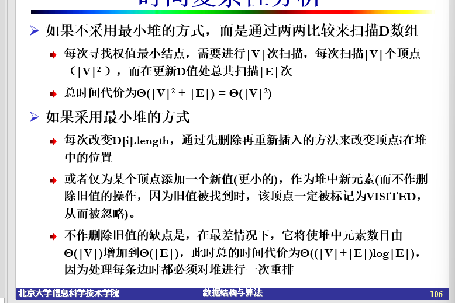
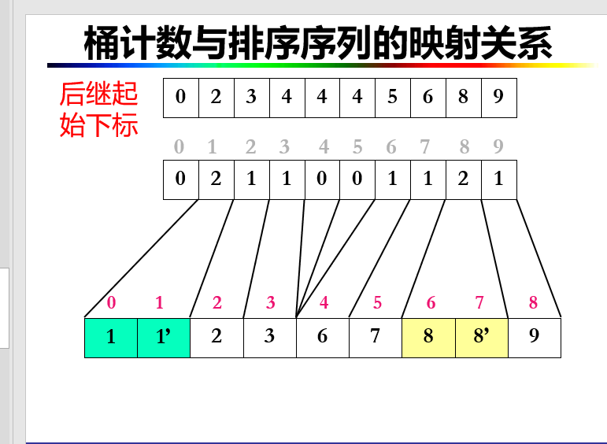
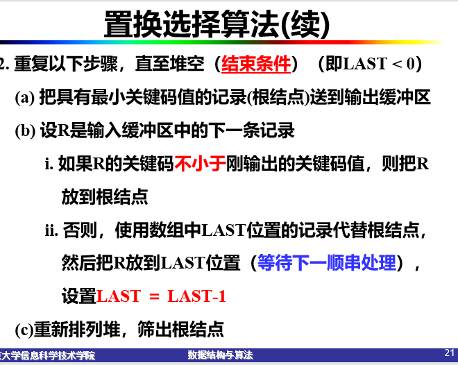
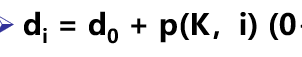
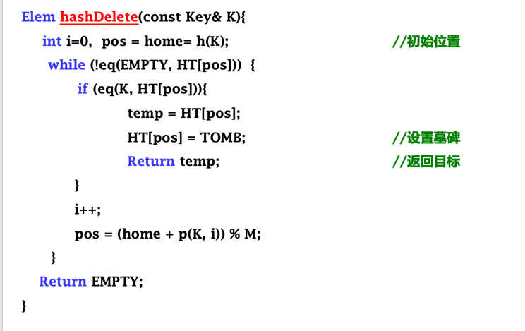
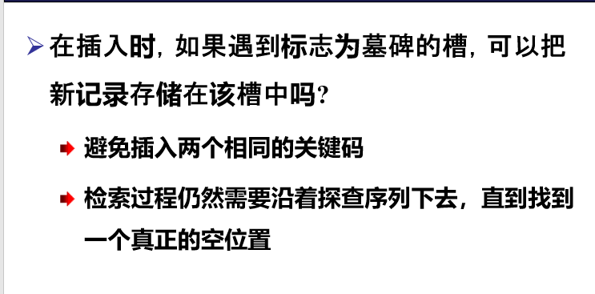
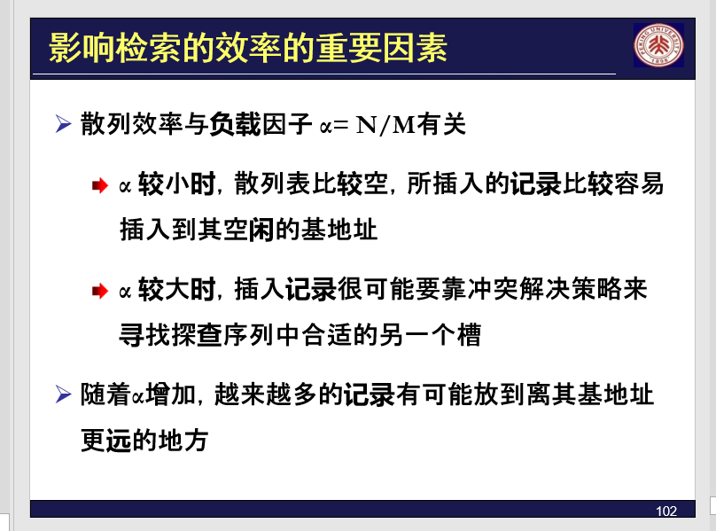
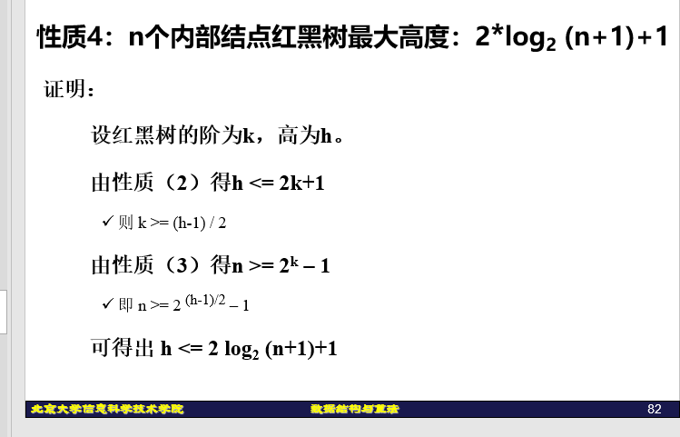
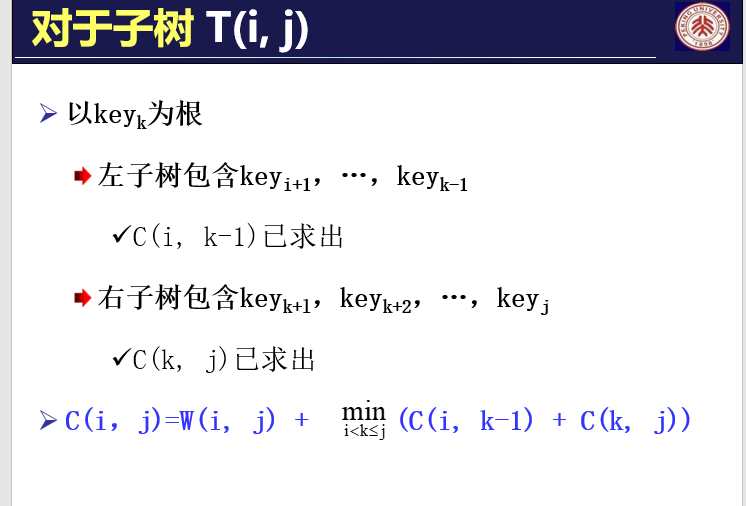
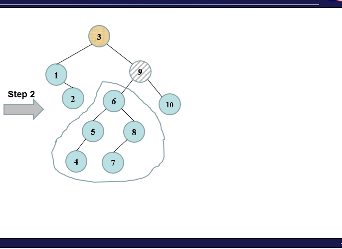

·         **北大信息学院《数据结构与算法****A****》期末考试**

**1.**   **考试时间和地点**

考试时间：第1周 周日(2025.01.05) 上午 8:30 –10:30，

考试地点: 理教303

**2.** **考试题型**

填空或者选择、简答与辨析、算法填空和设计分析与证明

注意：

（1）数据结构/算法设计与分析题只要写明基本思想、无歧义即可，必要时加上足够的注释。

（2）对于算法中直接使用的类和函数（例如栈、队列的函数），应该先写ADT，并简单说明算法中用到的重要函数的功能、入口参数、出口参数。

**3.** **考试范围和重点**

7-12章，以本文最后的内容为复习重点，尤其是★标出部分为重中之重。

考试时如果涉及到本大纲没有列出的内容，那么试卷中会给出足够的定义和性质。

**4.** **考场安排和注意事项**

1) 没有正式选课的旁听同学，请不要来考场。
2) 请随身带好您的学生证(或其他可以证明身份的证件)，笔和涂改工具参加考试。
3) 考试形式为闭卷，可以使用计算器。

 4）考前10分钟，请大家把书包、课本、讲义、作业本、自带的草稿纸等放在教室前面的讲台和窗台上，只需要留下学生证(或其他可以证明身份的证件)，笔和涂改工具。教室清理干净后，可以提前5分钟发放试卷(带有草稿纸和答题纸，可以撕下来)，从前排向后排发放。注意在试卷纸和有效答题纸上写上姓名和学号，并且一定要在试卷纸的诚实答题宣言旁边的姓名和学号栏签名（否则，试卷计零分）。

5) 我们统一发草稿纸，不够可以随时举手要。
6) 请大家注意考场纪律，不要交头接耳，私下讨论。考试时对试题有疑问，可以举手，待监考老师来到旁边时，再请向监考老师询问。

 7）考试时间为120分钟，中间不休息。提前15分钟提醒大家整理试卷，注意写好姓名和学号。

8) 监考老师宣布“考试时间到”以后，请大家停笔（不停笔的同学，监考老师有权没收试卷并宣布作废），把草稿纸和答题纸放在试卷上面，使姓名和学号朝外（诚实答题宣言旁边的姓名和学号朝向最外面），对折以后放在桌面上。监考老师收卷清点无误，并宣布“全班同学都可以离开了”以后方可集体离开。注意，不要把试卷题带出考场，否则将计零分。
9) 提前交卷的同学，把试卷交到讲台上，并收拾好自己的东西，迅速离开考场。

**5.** **答疑安排**

随时联系助教或者老师进行答疑！

**复习大纲**

从第7章图考到第12章高级数据结构。各章节以下面的内容为复习重点。尤其是绿颜色文字或★标出部分为重中之重。期中考过的内容，期末不直接考察，但可能在内容上有所涉及。

 

 **第****7****章** **图**

一. 概念

1. 图的深度周游
2. 图的宽度周游
3. 图的生成树、生成树林、最小生成树

二. 方法及算法 ★

1. 图的存储方法★ 相邻矩阵和邻接表
2. 图的周游 （1） 深度优先 （2） 宽度优先
3. 图的生成树与最小生成树

² 从某一点出发，按深度优先或宽度优先周游的生成树

² 最小生成树 ① Prim算法 ② Kruskal算法(避圈法)

4. ★ 拓扑排序 : 对于给定图，找出若干个或所有拓扑序列。任何有向无环图，都可以拓扑排序。
5. ★ 最短路径算法：Dijkstra算法、Floyd算法(属于动态规划法) ★
6. ★ 最小生成树：Prim算法、Kruskal算法都是典型的贪心法（退化的动态规划法）

 

**★****第****8****章** **内排序**

1. 重点排序算法：直接插入法、★Shell排序、★快速排序、★基数排序、归并排序
2. 算法分析

1）基于比较次数和移位次数分析最好、最坏的时间、空间：直接插入法、二分法插入排序、起泡排序、直接选择、快速排序、基数排序、归并排序

  2） 记住各种排序方法的平均时间

3. 各种排序方法的局部修改和混合应用

　

**第****9****章** **文件管理和外排序**

二. 方法及算法

1. ★ 置换选择排序 
2. ★ 多路归并 (败者树，最佳归并树，多路归并的读盘和写盘次数)

 

**第****10****章** **检索**

一. 概念

1. 平均检索长度  
2. 二分法检索 

★3. 散列表、同义词、碰撞、堆积

二. 方法

1. 二分法检索的判定树、查找某个结点的比较次数
2. 散列表: 1) 散列函数的选择 (除余法、平方取中法、折叠法)

​         2) 冲突处理方法 (分离同义词子表、线性探测、双散列函数)

★ 三. 散列算法（查找、插入、删除，对墓碑的处理）

 

**第****11****章** **索引技术**

一. 概念

1. 顺序文件 2. 散列文件 3. 倒排文件 4. 静态索引结构 5.动态索引结构(B树) 6. 红黑树

二. 方法（不考算法代码）

 ★1.  B树、B+树的插入 (注意保持性质，特别是等高；以及子结点和关键码个数的上下限制)

 ★2. B树/B+树的读盘和写盘次数分析 

3. B树/B+树的效率分析

 B树中关键码没有重复，父结点中的关键码是其子结点的分界；B+中最底层是关键码的一个全集，往根的方向一层层复写。

  B树插入 : 插入 ------- 分裂

  B+树插入 : 插入 -------- 分裂

  ★4.  红黑树的插入方法

  插入算法首先是采用BST的方法把结点插入到位，然后注意调整。尤其是“红红”冲突的解决，注意有换色、重构。

 

**第****12****章** **高级数据结构**

一. 概念

 1 . 多维数组和稀疏矩阵 2.  广义表  3. Trie树  4. Patricia 5.  AVL树  6. 伸展树

二. 方法

1. 特殊矩阵和稀疏矩阵的计算，重点在于理清楚索引值的规律。

★ 2. 广义表的结构和周游

3. 字符树：Trie树和Patricia树 （只做了解）
4. 最佳二叉搜索树，需要理解平均检索长度最优的特点

★ 5.  AVL平衡二叉树的插入方法：注意首先找到失衡结点，注意LL、LR、RL、RR的四种旋转调整。不考删除算法，但可能考相关性质

★6. 伸展树及其简单应用：伸展树在搜索过程中旋转调整结构，使访问最频繁的结点靠近树结构的根。伸展树的旋转分为：单旋转、一字形旋转和之字形旋转。注意伸展树的变种，例如半伸展树。

 

三. 算法

Splay树的插入及区间操作。

 


# 图

## 图的表示

- 点用V
- 边用E


## 概念

- 邻接点：相邻顶点
  - 一条边所连接的两个顶点，成为`邻接点`
- 顶点的度
  - 入度
  - 出度
  - 终端节点（叶子）

$$
e=\frac{1}{2}\sum_{i=1}^nd_{i} \ \ \ \ d_i是V_i的度数
$$

有根图


## 图的相邻矩阵表示法

$$
A[i,j]=\begin{cases}
1,若(V_i,V_j)或<V_i,V_j>是图G的边\\
0,若(V_i,V_j)或<V_i,V_j>不是图G的边
\end{cases}
$$


加权矩阵


$$
A_4=\begin{bmatrix}
0&3&0&15\\
3&0&4&0\\
0&4&0&6\\
15&0&6&0\\
 \end{bmatrix}
$$

## 图的邻接表表示法

邻接矩阵表示法的特点

- 矩阵的规模只与顶点的个数n有关$n^2$
- 与边无关
- 由于大量的边不存在，造成空间浪费

邻接表表示法

- 即与顶点有关，又与边有关
- 顶点表：对应n个顶点，包括顶点数据和指向边表的指针
- 边链表：对应m条边，包括顶点序号和指向边表下一表目指针


*需要$|V|+2|E|$*个存储单元

## 十字链表（不考）

顶点表：对应图的顶点，三个域，分别是顶点的数据，(`firstinarc`)入边表的头指针和(`firstoutarc`)出边表的头指针

边链表：对应图的边，5个域，起点(`fromvex`)和终点(`tovex`)的顶点序号；边权值的info值；

`fromnextarc`指针指向下一个以`fromvex`为起点的边

`tonextarc`指针指向下一个以`tovex`为终点的边


## 图的周游

### 深度优先搜索(DFS)

- 从一个顶点出发，访问它的所有邻接点，再依次从这些邻接点出发，访问它们的邻接点，直到所有顶点都被访问过为止


#### 时间复杂度分析

- `dfs`对每一条边处理一次（无向图每条边从两个方向处理），每个顶点访问一次
- 邻接表表示法：有向图为$O(|V|+|E|)$，无向图为$O(|V|+2|E|)$
- 邻接矩阵表示法：有向图为$O(|V|^2)$，无向图为$O(|V|^2)$

#### 深度优先搜索树


边的分类


### 广度优先搜索(BFS)


广度优先搜索树


```CPP
void BFS(Graph& G, int V) {
    using std::queue; // 初始化广度优先遍历要用到的队列
    queue<int> Q;
    G.Mark[V] = VISITED; // 访问顶点V，并标记其标志位，V入队
    Visit(G, V); 
    Q.push(V);

    while (!Q.empty()) { // 如果队列仍然有元素
        int V = Q.front(); 
        Q.pop(); // 取顶部元素，并出队

        // 将与该点相邻的每一个未访问点都入队
        for (Edge e = G.FirstEdge(V); G.IsEdge(e); e = G.NextEdge(e)) {
            if (G.Mark[G.ToVertex(e)] == UNVISITED) {
                G.Mark[G.ToVertex(e)] = VISITED;
                Visit(G, G.ToVertex(e));
                Q.push(G.ToVertex(e)); // 入队
            }
        }
    }
}
```

### 拓扑排序（重点）

- 是指以某种线性顺序来组织多项任务，以便能在满足先决条件的情况下逐个完成各项任务
    - 有向无环图(DAG)进行拓扑排序
    - 从图中选择一个没有前驱的顶点，输出它
    - 从图中删除该顶点和所有以它为起点的边
    - 重复上述两步，直到所有顶点都已输出，或者图中不存在无前驱的顶点为止

- 若环路存在，则无法进行拓扑排序（最后仍然有顶点没有输出，但没有入度为0的顶点）


### 复杂度


### DFS——拓扑排序

假设在DAG中有一条有向路径从vi到vj，根据拓扑排序的规则，vi一定排在vj之前。在DFS中利用类似后序访问的规则，当vi所有可以达到的节点被访问完以后，vi才会被访问，这样节点被访问的顺序，恰好是拓扑排序的逆序。


**注意**：深度优先搜索无法判断环的存在

## 最短路径算法

### 单源最短路径（`Dijkstra`算法）

- 从一个顶点出发，到其他所有顶点的最短路径


```cpp
class Dist { 
    // Dist类，Dijkstra和Floyd算法用于保存最短路径信息
public:
    int index;   // 顶点的索引值，仅Dijkstra算法用到
    int length;  // 当前最短路径长度
    int pre;     // 路径最后经过的顶点
};

void Dijkstra(Graph& G, int s, Dist* &D) {
    D = new Dist[G.VerticesNum()]; // 初始化Mark数组、D数组
    for (int i = 0; i < G.VerticesNum(); i++) {
        G.Mark[i] = UNVISITED;     // 标记为未访问
        D[i].length = INFINITY;   // 初始化最短路径长度为无穷大
        D[i].index = i;           // 设置顶点索引
        D[i].pre = -1;            // 路径的前驱初始化为 -1
    }
    D[s].length = 0;              // 源点为s，路径长度设为0
    MinHeap<Dist> H(G.EdgesNum()); // 声明一个最小值堆
    H.Insert(D[s]);                // 将源点初始化进堆

    for (int i = 0; i < G.VerticesNum(); i++) {
        bool FOUND = false;
        Dist d;

        while (!H.empty()) {       // 找下一最短路径的顶点
            d = H.RemoveMin();     // 从堆中取出最小值
            if (G.Mark[d.index] == UNVISITED) { // 如果是未访问的点
                FOUND = true; 
                break;             // 该点加入已访问组
            }
        }
        if (!FOUND) break;         // 如果没有找到，退出

        int v = d.index; 
        G.Mark[v] = VISITED;       // 标记顶点v为已访问
        Visit(v);                  // 打印输出（可选操作）

        for (Edge e = G.FirstEdge(v); G.IsEdge(e); e = G.NextEdge(e)) { 
            // 遍历v的所有邻接边
            if (D[G.ToVertex(e)].length > D[v].length + G.Weight(e)) { 
                // 如果发现更短路径，更新权值
                D[G.ToVertex(e)].length = D[v].length + G.Weight(e);
                D[G.ToVertex(e)].pre = v;    // 更新路径的前驱
                H.Insert(D[G.ToVertex(e)]); // 将更新后的节点重新加入堆
            }
        }
    }
}

```



### 多源最短路径（`Floyd`算法）

- 方法一：反复执行Dijkstra算法，时间复杂度为$O(n^3)$
- 方法二：Floyd算法，时间复杂度为$O(n^3)$


## 最小生成（支撑）树


### Kruskal算法


- 算法代价：$O(E\log E)$，即堆排序的时间复杂度

# 内排序

## 插入排序

### 直接插入排序

```cpp
void stringInsertSort(int A[], int n) {
	for(int i=1;i<n;i++){
        for(int j=i;j>0;j--){
            if(Array[j]<Array[j-1]){
                swap(Array[j],Array[j-1]);
            }
            else{
                break;
            }
        }
    }
}
```

稳定

时间复杂度：$O(n^2)$

空间复杂度：$O(1)$

### 优化的插入排序算法

```cpp
void ImprovedInsertSort(int A[], int n) {
    for (int i = 1; i < n; i++) {
        int temp = A[i];
        int j = i - 1;
        while (j >= 0 && A[j] > temp) {
            A[j + 1] = A[j];
            j--;
        }
        A[j + 1] = temp;
    }
}
```

### 基于二分查找的插入排序

```cpp
void BinaryInsertSort(int A[], int n) {
    for (int i = 1; i < n; i++) {
        int temp = A[i];
        int low = 0, high = i - 1;
        while (low <= high) {
            int mid = (low + high) / 2;
            if (A[mid] > temp) high = mid - 1;
            else low = mid + 1;
        }
        for (int j = i - 1; j >= low ; j--) {
            A[j + 1] = A[j];
        }
        A[low] = temp;//插入left
    }
}
```

- 最佳情况下代价为	$O(n\log n)$
- 平均情况下代价为	$O(n^2)$

## 冒泡排序


## 直接选择排序


**==不稳定==**


## ==shell排序==

直接插入排序的2个性质

- 当n较小时，直接插入排序较快
- 当序列基本有序时，直接插入排序较快

思想：

- 先将整个待排序的记录序列分割成若干子序列分别进行直接插入排序
- 逐渐扩大子序列的长度，直到整个序列被分为一个子序列


```cpp
void shellsort(int A[], int n) {
    for (int gap = n / 2; gap > 0; gap /= 2) {
     	for(int j=0;j<gap;j++){
            ModifiedInsertSort(A, n-j, gap);
        }
    }
}
void ModifiedInsertSort(int A[], int n, int gap) {
    for (int i = gap; i < n; i++) {
        int temp = A[i];
        int j = i - gap;
        while (j >= 0 && A[j] > temp) {
            A[j + gap] = A[j];
            j -= gap;
        }
        A[j + gap] = temp;
    }
}
```

## ==快速排序==

- 轴值选择：从待排序列中任选一个元素k作为轴值
- 序列划分：划分为子序列L和R，使得L中的元素都小于k，R中的元素都大于k
- 递归排序：对L和R分别进行快速排序

```cpp
void Quicksort(int A[], int low, int high) {
    if (low < high) {
        int pivot=SelectPivot(left,right);
        int pivot = Partition(A, low, high);
        Quicksort(A, low, pivot - 1);
        Quicksort(A, pivot + 1, high);
    }
}
int Partition(int Array[], int left, int right) {
    int i=left,j=right;
    int pivotValue=Array[left];		//将轴值放在临时变量中
    while(i!=j){
        while((Array[j]>pivotValue)&&(i<j))j--; //左移
        if(i<j){Array[i]=Array[j];i++;}					//交换
        while((Array[i]<=pivotValue)&&(i<j))i++;
        if(i<j){Array[j]=Array[i];j--;}
    }
    Array[i]=pivotValue; //轴值归位
    return i;
}
```

算法分析


平均性能推导：
$$
T(n)=O(nlogn)  						\\
T(n)=\frac{1}{n}\sum_{i=0}^{n-1}(T(i)+T(n-i-1))+cn\\
nT(n)=2\sum_{i=0}^{n-1}T(i)+cn^2  \\
nT(n)-(n-1)T(n-1)=2T(n-1)+2cn-c	\\
nT(n)=(n+1)T(n-1)+2cn  \\
\frac{T(n)}{n+1}=\frac{T(n-1)}{n}+\frac{2c}{n+1}
$$


## 归并排序


## 堆排序

略


## 桶排序





- 只适用于m较小的情况

​	
## ==基数排序==


### 如何实现

- 数组R长度n
- 基数r
- 排序码位数：d


### 算法分析

- 临时数组,n
- r个计数器
- 空间代价$O((n+r))$
- d次桶排序，每次代价$O(n+r)$
- 时间代价$O(d(n+r))$


# ==重点==


# 外排序

- 文件流是以外存文件为输入输出对象的数据流
- 文件流与文件不是同一个概念，文件流不是由若干个文件组成的流
- 文件流本身不是文件，而只是以文件为输入输出对象的流


## 外排序的时间组成

- 产生初始顺串的内排序所需时间
- 初始化顺串和归并过程所需的读写(I/O)时间
- 内部归并所需要的时间

==减少外存信息的读写次数是提高外部排序效率的关键==

## 置换选择排序





## 归并排序


## 多路归并树


**如何减小k路比较时的比较次数**

- 选择树
  - 赢者树
  - 败者树

### 赢者树


### 败者树


### 多路归并的效率


# 检索

平均检索长度
$$
ASL=\sum_{i=1}^nP_iC_i(P_i为检索第i个元素的概率，C_i为找到第i个元素所需的比较次数)
$$

## 顺序检索


## ==二分检索==

==前提条件==：待检索序列有序


## 散列表的检索

### 重要概念


### 散列函数


### 除余法


==注意==：M不能取偶数


### 平方取中法


### 折叠法


## 冲突解决


### 开散列方法

#### 拉链法


#### 桶式散列


## 闭散列方法


### 线性探测




### 改进线性探查


### 二次探查


### 二级聚集


### 双散列探查法

避免二级聚集


## 散列表的插入


## 散列表的检索


## 散列表的删除










# 索引


- 稀疏索引
- 稠密索引


## 线性索引


## 静态索引


## 倒排索引


## B树


插入看ppt

## 效率分析


## 红黑树





# 高级数据结构


## 特殊矩阵


## 广义表


## 最佳BST树


$$
卡特兰数\frac{1}{n+1}C_{2n}^{n}
$$




## ==AVL==


## 伸展树





