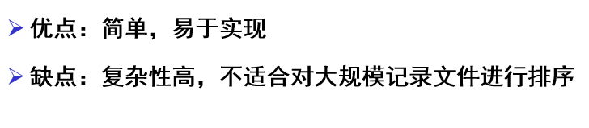
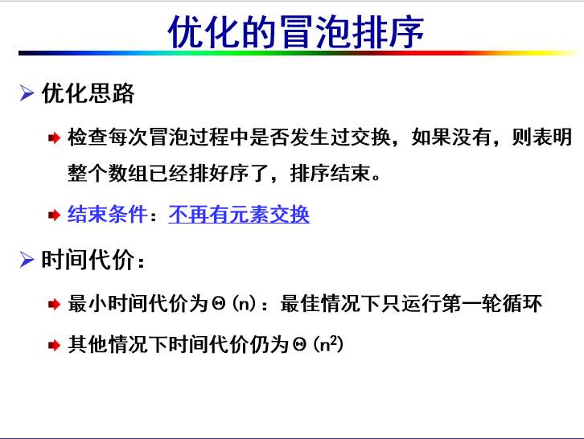
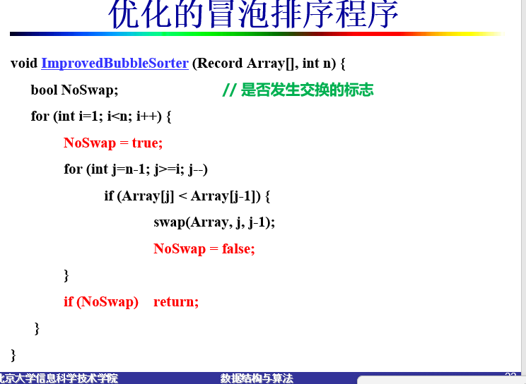
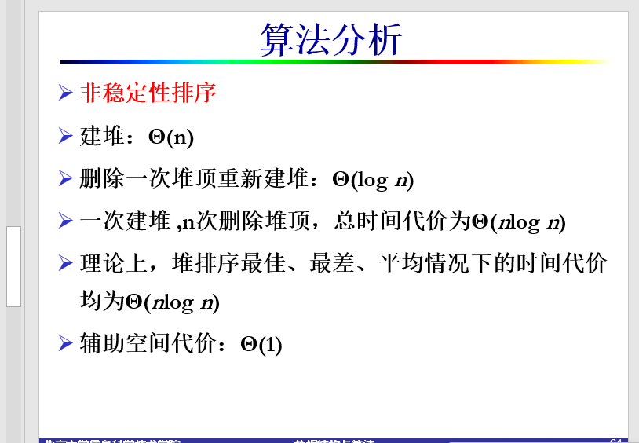
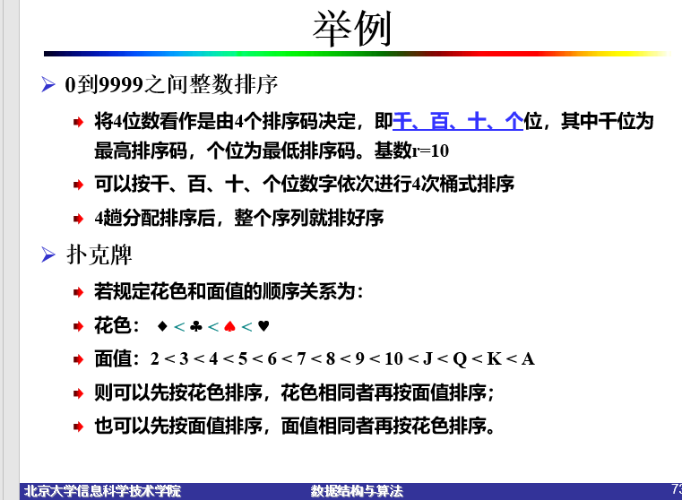
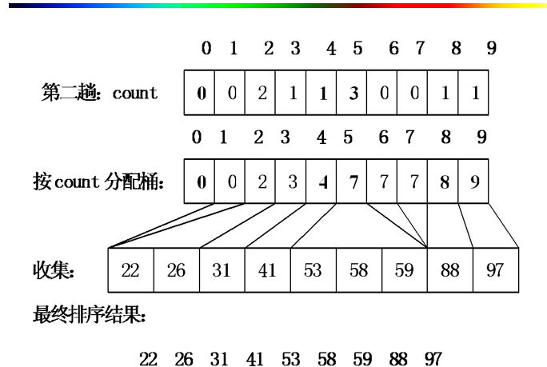

内排序

- 记录：进行排序的基本单位
- 关键码：唯一确定记录的一个或多个域
- 排序码：作为排序运算依据的一个或多个码
- 序列：线性表，由记录组成的集合
- 排序：将序列中的记录按照排序码特定顺序排列起来，即排序码域的值具有不减（或不增）的顺序


# 简单排序

- 插入排序
- 冒泡排序
- 选择排序



复杂度$O(n^2)$

## 插入排序


实现

```cpp
void StraightInsertSorter(Record Array[],int n){
    for(int i=1;i<n;i++){
        for(int j=i;j>0;j--){
            if(Array[j]<Array[j-1]){
                swap(Array,j,j-1);
            }
            else{
                break;//此时前面的已经排好序了
            }
        }
    }
}
```


优化


### 引入二分查找


实现：

```cpp
void BinaryInsertSorter(Record Array[], int n) {
    Record TempRecord;
    int left, right, middle;
    for (int i = 1; i < n; i++) {         // 依次插入第 i 个记录
        TempRecord = Array[i];            // 保存当前待插入记录
        left = 0; right = i - 1;          // 记录已排好序序列的左右位置
        
        while (left <= right) {
            middle = (left + right) / 2;
            if (TempRecord < Array[middle])
                right = middle - 1;
            else
                left = middle + 1;
        }
        
        for (int j = i - 1; j >= left; j--)  // 记录后移
            Array[j + 1] = Array[j];
        
        Array[left] = TempRecord;           // 插入 left 指针位置
    }
}

```


## 冒泡


算法稳定






## 直接选择排序


```cpp
void StraightSelectSorter(Record Array[], int n) {
    // 依次选出第 i 小的记录，即剩余记录中最小的那个
    for (int i = 0; i < n - 1; i++) {
        int Smallest = i;                 // 首先假设记录 i 就是最小的
        for (int j = i + 1; j < n; j++)   // 开始向后扫描所有剩余记录
            if (Array[j] < Array[Smallest])
                Smallest = j;             // 如发现更小记录，记录其位置
                
        swap(Array, i, Smallest);         // 将第 i 小的记录放在第 i 个位置
    }
}

```

==注意==：不稳定！


# shell排序

- shell排序的提出基于直接插入排序的两个性质
  - 在待排序序列较短情形下效率高
  - 在整体有序的情形下时间代价低
- shell排序又称为“缩小增量排序”


不稳定的排序方法

```cpp
// Shell 排序实现，delta=2
void ShellSorter(Record Array[], int n) {
    for (int delta = n / 2; delta > 0; delta /= 2) {
        // 分别对 delta 个子序列排序
        for (int j = 0; j < delta; j++)
            ModifiedInsertSort(&Array[j], n - j, delta);
    }
}
void ModifiedInsertSort(Record Array[], int n, int delta) {
    // 对子序列中第一个记录排序
    for (int i = delta; i < n; i += delta) {
        for (int j = i; j >= delta; j -= delta) {
            if (Array[j] < Array[j - delta])
                swap(Array, j, j - delta);
            else
                break;
        }
    }
}
```


# 基于分治法的排序

## 快速排序


```cpp
#include <iostream>
using namespace std;

// 定义Record结构体
struct Record {
    int key;
    // 可以根据需要添加其他字段
};

// 选择轴值函数
int SelectPivot(int left, int right) {
    return left; // 简单选择最左边的元素作为轴值
}

void QuickSort(Record Array[], int left, int right)
{
    if (left < right)
    {
        int pivot = SelectPivot(left, right);  // 选择轴值
        pivot = Partition(Array, left, right); // 序列分割
        QuickSort(Array, left, pivot - 1);     // 对左子序列递归
        QuickSort(Array, pivot + 1, right);    // 对右子序列递归
    }
}

int Partition(Record Array[], int left, int right)
{
    int i = left, j = right;         // i为左指针，j为右指针
    Record pivotValue = Array[left]; // 将轴值放在临时变量中
    while (i != j)
    { // 划分过程
        while ((Array[j].key > pivotValue.key) && (i < j))
            j--; // 左移
        if (i < j)
        {
            Array[i] = Array[j];
            i++;
        } // 交换
        while ((Array[i].key <= pivotValue.key) && (i < j))
            i++; // 右移
        if (i < j)
        {
            Array[j] = Array[i];
            j--;
        } // 交换
    }
    Array[i] = pivotValue; // 轴值归位
    return i;              // 返回轴值位置
}

int main() {
    Record Array[] = {{3}, {6}, {8}, {10}, {1}, {2}, {1}};
    int n = sizeof(Array) / sizeof(Array[0]);
    QuickSort(Array, 0, n - 1);
    for (int i = 0; i < n; i++) {
        cout << Array[i].key << " ";
    }
    cout << endl;
    return 0;
}

```


## 归并排序

- 简单地将原始序列划分为两个子序列
- 分别对每个子序列递归划分，直到不可划分为止
- 最后将排好序的子序列合并为一个有序序列，即归并过程


```cpp
template <class Record>
void MergeSort(Record Array[], Record TempArray[], int left, int right) {
    int middle;
    if (left < right) { // 如果序列中只有0或1个记录，就不排序
        middle = (left + right) / 2; // 从中间划分为两个子序列
        MergeSort(Array, TempArray, left, middle); // 对左边一半进行递归
        MergeSort(Array, TempArray, middle + 1, right); // 对右边一半进行递归
        Merge(Array, TempArray, left, right, middle); // 进行归并
    }
}

template <class Record>
void Merge(Record Array[], Record TempArray[], int left, int right, int middle) {
    int i, j, index1, index2;
    for (j = left; j <= right; j++) // 将数组暂存入临时数组
        TempArray[j] = Array[j];

    index1 = left;       // 左边子序列的起始位置
    index2 = middle + 1; // 右边子序列的起始位置
    i = left;            // 从左开始归并

    while (index1 <= middle && index2 <= right) {
        // 取较小者插入合并数组中
        if (TempArray[index1] <= TempArray[index2]) // 为保持稳定，相等时左边优先
            Array[i++] = TempArray[index1++];
        else
            Array[i++] = TempArray[index2++];
    }

    while (index1 <= middle) // 只剩左序列，可以直接复制
        Array[i++] = TempArray[index1++];

    while (index2 <= right) // 只剩右序列，可以直接复制
        Array[i++] = TempArray[index2++];
}

```

# 堆排序




# 分配排序

## 桶排序


```cpp
 //统计每个取值出现的次数
  for (i=0;i<n;i++)
	count[Array[i]]++;
  //统计小于等于i的元素个数
  for (i=1;i<max;i++)
  	count[i]=count[i-1]+count [i];  
  //按顺序输出有序序列
  for (i=n-1;i>=0;i--)
     	Array[--count[TempArray[i]]] = TempArray[i];

```


实现

```cpp
#include<iostream>
using namespace std;

// ...existing code...
void BucketSort(int *array, int n, int m){
    // 初始化临时数组
    int temparray[n] = {0};
    // 将原数组复制到临时数组
    for (int i = 0; i < n; i++){
        temparray[i] = array[i];
    }

    // 初始化计数数组
    int count[m] = {0};
    // 统计每个元素的出现次数
    for (int i = 0; i < n; i++){
        count[array[i]]++;
    }
    // 计算累计计数
    for (int i = 1; i < m; i++){
        count[i] += count[i - 1];
    }
    // 根据计数数组排序
    for (int i = 0; i < n; i++){
        array[--count[temparray[i]]] = temparray[i];
    }
}

// 添加主函数以检验BucketSort的正确性
int main(){
    int array[] = {5, 3, 8, 4, 2};
    int n = sizeof(array) / sizeof(array[0]);
    int m = 10; // 假设数组中的最大值小于10
    BucketSort(array, n, m);
    cout << "排序后的数组: ";
    for(int i = 0; i < n; i++) cout << array[i] << " ";
    cout << endl;
    return 0;
}
```


## 基数排序

这一页介绍了**基数排序**的基本概念和原理。

### 主要内容：
1. **排序码由多个部分组成**：
   - 一个序列 \( R = \{ r_0, r_1, \ldots, r_{n-1} \} \) 中的每个排序码 \( K \) 由 \( d \) 位子排序码组成，可以表示为 \( K = (k_{d-1}, k_{d-2}, \ldots, k_1, k_0) \)。
   - 其中，\( k_{d-1} \) 称为**最高位排序码**，\( k_0 \) 称为**最低位排序码**。

2. **排序条件**：
   - 对于任意两个记录 \( R_i \) 和 \( R_j \)，若 \( R \) 是有序的，则需要满足：
     \[
     (k_{i,d-1}, k_{i,d-2}, \ldots, k_{i,1}, k_{i,0}) \leq (k_{j,d-1}, k_{j,d-2}, \ldots, k_{j,1}, k_{j,0})
     \]
   - 也就是说，需要从最高位到最低位逐位比较子排序码。

3. **基数**：
   - 每个子排序码 \( K_i \) 的取值范围称为**基数**，用 \( r \) 表示。

### 举例：
假设有三个两位数的排序码：45、32 和 23。
- 可以分解为十位和个位两部分，即 \( K = (十位, 个位) \)。
- 比如，45 的排序码表示为 \( (4, 5) \)，32 表示为 \( (3, 2) \)，23 表示为 \( (2, 3) \)。
- 如果按照从高位到低位的顺序进行排序，首先比较十位，得到 23 < 32 < 45。



## 高位优先法


## 低位优先


### 基于顺序存储的基数排序

- 数组R长度：n
- 基数：r
- 排序码位数：d




```cpp
void RadixSorter<Record>::Sort(Record Array[], int n, int d, int r) {
    // n 为数组长度，d 为排序码数，r 为基数
    Record *TempArray = new Record[n]; // 临时数组
    int *count = new int[r];           // 计数器
    int i, j, k;
    int Radix = 1;

    for (i = 1; i <= d; i++) {         // 取 Array[j] 的第 i 位排序码
        for (j = 0; j < r; j++)        // 分别对第 i 个排序码分配
            count[j] = 0;              // 初始化计数器均为 0

        for (j = 0; j < n; j++) {      // 统计每个桶中的记录数
            // 取 Array[j] 的第 i 位排序码
            k = (Array[j] / Radix) % r;
            count[k]++;                // 相应计数器加 1
        }

        // 每个元素的后继起始下标地址
        for (j = 1; j < r; j++)
            count[j] = count[j - 1] + count[j];

        // 将所有桶中的记录依次收集到 TempArray 中
        for (j = n - 1; j >= 0; j--) {
            k = (Array[j] / Radix) % r; // 取 Array[j] 的第 i 位排序码
            TempArray[--count[k]] = Array[j];
        }

        // 将临时数组中的内容复制到 Array 中
        for (j = 0; j < n; j++)
            Array[j] = TempArray[j];

        Radix *= r;
    }

    delete[] TempArray;
    delete[] count;
}

```

### 基于静态链的基数排序


根据提供的图片内容，以下是提取并合并的完整代码：

```cpp
class Node { // 结点类
public:
    int key;  // 结点的关键码值
    int next; // 后继结点下标
};

class StaticQueue { // 静态队列类
public:
    int head; // 头指针
    int tail; // 尾指针
};

// 基数排序算法
void RadixSort(Record *Array, int n, int d, int r) {
    int i, first = 0; // first 指向静态链中的第一个记录
    // 存放 r 个桶的静态队列
    StaticQueue *queue = new StaticQueue[r];
    // 建链，初始为 next 域指向下一个记录
    for (i = 0; i < n - 1; i++)
        Array[i].next = i + 1;
    Array[n - 1].next = -1; // 链尾 next 为空

    // 对第 i 个排序码进行分配和收集，共 d 趟
    for (i = 0; i < d; i++) {
        Distribute(Array, first, i, r, queue);
        Collect(Array, first, r, queue);
    }
    delete[] queue;
}

// 分配过程
void Distribute(Record *Array, int first, int i, int r, StaticQueue *queue) {
    // first 为静态链中的第一个记录，i 为第 i 位排序码，r 为基数
    for (int j = 0; j < r; j++) // 初始化 r 个队列
        queue[j].head = -1;
    while (first != -1) { // 对整个静态链进行分配
        int k = Array[first].key; // 取第 i 位排序码数字
        for (int a = 0; a < i; a++)
            k = k / r;
        k = k % r;
        if (queue[k].head == -1)
            queue[k].head = first;
        else
            Array[queue[k].tail].next = first;
        queue[k].tail = first; // first 为子序列的尾部
        first = Array[first].next; // 继续分配下一个记录
    }
}

// 收集过程
void Collect(Record *Array, int &first, int r, StaticQueue *queue) {
    int last, k = 0;
    // 找到第一个非空队列
    while (queue[k].head == -1) k++;
    first = queue[k].head;
    last = queue[k].tail;
    while (k < r - 1) { // 继续收集下一个非空队列
        k++;
        if (queue[k].head != -1) { // 将非空序列连接起来
            Array[last].next = queue[k].head;
            last = queue[k].tail; // 尾部记录
        }
    }
    Array[last].next = -1; // 收集完毕
}
```

### 代码说明
- **Node 类**和**StaticQueue 类**：定义了链表结点和静态队列的结构。
- **RadixSort 函数**：执行基数排序，通过调用 `Distribute` 和 `Collect` 完成每一位的分配和收集。
- **Distribute 函数**：将记录分配到不同的队列（桶）中。
- **Collect 函数**：收集每个队列中的记录，形成有序链。

# 索引排序


# 分类

