# 图

## 基于邻接表的图的ADT实现

```cpp
class Graph { // 图的ADT
public:
    int VerticesNum(); // 返回图的顶点个数
    int EdgesNum();    // 返回图的边数

    // 返回与顶点oneVertex相关联的第一条边
    Edge FirstEdge(int oneVertex);

    // 返回与边PreEdge有相同关联顶点oneVertex的下一条边
    Edge NextEdge(Edge preEdge);

    // 添加一条边
    bool setEdge(int fromVertex, int toVertex, int weight);

    // 删除一条边
    bool delEdge(int fromVertex, int toVertex);

    // 如果oneEdge是边则返回TRUE，否则返回FALSE
    bool IsEdge(Edge oneEdge);

    // 返回边oneEdge的始点
    int FromVertex(Edge oneEdge);

    // 返回边oneEdge的终点
    int ToVertex(Edge oneEdge);

    // 返回边oneEdge的权
    int Weight(Edge oneEdge);
};

class Edge { // 边的基类
public:
    int from, to, weight;

    Edge() { // 构造函数
        from = -1; to = -1; weight = 0;
    }

    Edge(int f, int t, int w) { // 构造函数
        from = f; to = t; weight = w;
    }

    bool operator > (Edge oneEdge) { // 定义边比较运算符 ">"
        return weight > oneEdge.weight;
    }

    bool operator < (Edge oneEdge) { // 定义边比较运算符 "<"
        return weight < oneEdge.weight;
    }
};

class Graphl : public Graph { // 图的基类
public:
    int numVertex, numEdge;       // 图的顶点和边的数目
    int *Mark, *indegree;         // 保存顶点是否被访问过和顶点入度的数组

    Graph(int numVert) {          // 构造函数
        numVertex = numVert;
        numEdge = 0;
        indegree = new int[numVertex];    // 初始化顶点入度数组；
        Mark = new int[numVertex];        // 初始化顶点是否被访问的标志数组；
        for (int i = 0; i < numVertex; i++) {
            Mark[i] = UNVISITED;
            Indegree[i] = 0;
        }
    }

    ~Graph() { // 析构函数
        delete[] Mark;
        delete[] indegree;
    }

    virtual Edge FirstEdge(int oneVertex) = 0; // 返回顶点的第一条边
    virtual Edge NextEdge(Edge preVertex) = 0; // 返回当前边的下一条边
    int verticesNum() { return numVertex; }    // 返回顶点数；
    int EdgesNum() { return numEdge; }         // 返回边数；

    bool isEdge(Edge oneEdge) { // 判断oneEdge是否为边；
        if (oneEdge.weight > 0 && oneEdge.weight < INFINITY && oneEdge.to >= 0)
            return true;
        else
            return false;
    }

    int FromVertex(Edge oneEdge) { // 返回边oneEdge的始点
        return oneEdge.from;
    }

    int ToVertex(Edge oneEdge) {   // 返回边oneEdge的终点
        return oneEdge.to;
    }

    int Weight(Edge oneEdge) {     // 返回边oneEdge的权
        return oneEdge.weight;
    }

    virtual void setEdge(int from, int to, int weight) = 0; // 设置边
    virtual void delEdge(int from, int to) = 0;             // 删除边
};

struct listUnit { // 邻接表目中数据部分的结构定义
    int vertex;   // 边的终点；
    int weight;   // 边的权；
};

template <class Elem> // 链表元素
class link {
public:
    Elem element;    // 顶点元素；
    link *next;      // 指针元素；
    link (const Elem& elemval, Link *nextval = NULL) {
        element = elemval;      // 构造函数
        next = nextval;         // 初始化顶点值；
    }
    link (link *nextval = NULL) { next = nextval; } // 构造函数
};

template <class Elem> // 链表
class LList {
public:
    Link <Elem> *head;  // 定义头指针head，只为操作方便
    LList() {            // 构造函数：
        head = new Link<Elem>();
    }

    void removeall() {   // 释放边表所有表目占据的空间；
        Link<Elem> *fence;
        while (head != NULL) {
            fence = head;
            head = head->next;
            delete fence;
        }
    }

    ~LList() { removeall(); } // 析构函数
};

class Graphl : public Graph {
private:
    LList <listUnit> *graList; // 保存所有边表的数组；
public:
    Graphl(int numVert) : Graph(numVert) { // 构造函数
        graList = new LList<listUnit>[numVertex];
    }

    ~Graphl() { // 析构函数
        delete[] graList;
    }
};

Edge firstEdge(int oneVertex) { // 返回顶点oneVertex的第一条边
    Edge myEdge;
    myEdge.from = oneVertex;
    myEdge.to = -1;
    Link<listUnit> *temp = graList[oneVertex].head; // 取对应链表的头
    if (temp->next != NULL) {
        myEdge.to = temp->next->element.vertex;
        myEdge.weight = temp->next->element.weight;
    }
    return myEdge;
}

Edge nextEdge(Edge preVertex) { // 返回与preEdge有相同顶点的下一条边
    Edge myEdge;
    myEdge.from = preEdge.from;
    myEdge.to = -1;
    Link<listUnit> *temp = graList[preEdge.from].head;
    while (temp->next != NULL && temp->next->element.vertex <= preEdge.to) {
        temp = temp->next;
    }
    if (temp->next != NULL) {
        myEdge.to = temp->next->element.vertex;
        myEdge.weight = temp->next->element.weight;
    }
    return myEdge;
}

void setEdge(int from, int to, int weight) { // 为图设定一条边；
    Link <listUnit> *temp = graList[from].head;
    while (temp->next != NULL && temp->next->element.vertex < to) {
        temp = temp->next;  // 确定要插入边表的位置
    }
    if (temp->next == NULL) { // 为空，在尾部插上这条边
        temp->next = new Link<listUnit>;
        temp->next->element.vertex = to;
        temp->next->element.weight = weight;
        numEdge++;
        indegree[to]++;
        return;
    }
    if (temp->next->element.vertex == to) { // 边已经在图中存在，只改权值；
        temp->next->element.weight = weight;
        return;
    }
    if (temp->next->element.vertex > to) { // 不存在，在边表中插入该条边；
        Link <listUnit> *other = temp->next;
        temp->next = new Link<listUnit>;
        temp->next->element.vertex = to;
        temp->next->element.weight = weight;
        temp->next->next = other;
        numEdge++;
        indegree[to]++;
    }
}

void delEdge(int from, int to) { // 删除图的一条边；
    Link <listUnit> *temp = graList[from].head;
    while (temp->next != NULL && temp->next->element.vertex < to) {
        temp = temp->next;  // 确定要插入边表的位置
    }
    if (temp->next == NULL) return; // 边在图中不存在；
    if (temp->next->element.vertex > to) return; // 边在图中不存在；
    if (temp->next->element.vertex == to) { // 边在图中存在；
        Link <listUnit> *other = temp->next->next;
        delete temp->next;
        temp->next = other;
        numEdge--;
        indegree[to]--;
        return;
    }
}

```


## 图的周游

### dfs

递归版本：

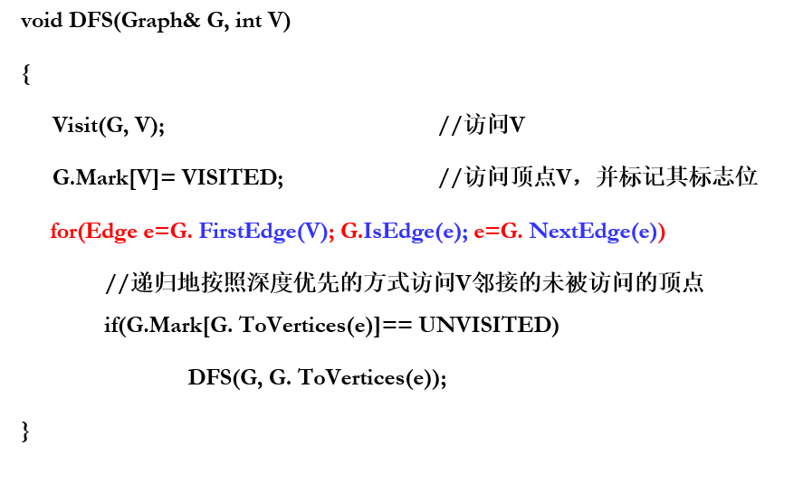

非递归版本

```cpp
#include <iostream>
#include <vector>
#include <stack>
using namespace std;
struct Gnode
{
    int i;
    vector<Gnode *> neighbornodes;
    bool visited = false;
};
void dfs(Gnode *a)
{
    stack<Gnode *> st;
    st.push(a);
    while (!st.empty())
    {
        Gnode *tmp = st.top();
        st.pop();
        cout << tmp->i << " ";
        tmp->visited = true;
        for (int i = 0; i < tmp->neighbornodes.size(); i++)
        {
            if (!tmp->neighbornodes[i]->visited)
            {
                st.push(tmp->neighbornodes[i]);
            }
        }
    }
}

int main()
{
    // 创建节点
    Gnode node0, node1, node2, node3;
    node0.i = 0;
    node1.i = 1;
    node2.i = 2;
    node3.i = 3;

    // 建立邻居关系
    node0.neighbornodes.push_back(&node1);
    node0.neighbornodes.push_back(&node2);
    node1.neighbornodes.push_back(&node2);
    node2.neighbornodes.push_back(&node0);
    node2.neighbornodes.push_back(&node3);
    node3.neighbornodes.push_back(&node3);

    // 执行DFS
    dfs(&node2);

    return 0;
}

```

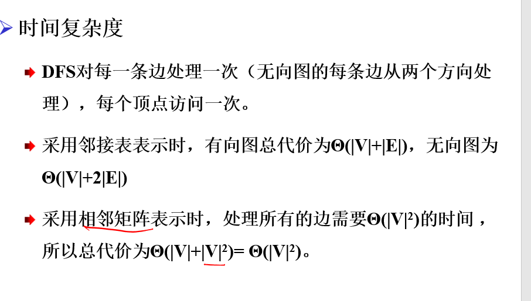

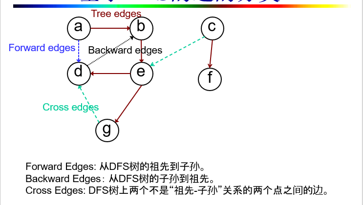

### 通过检查是否存在backward edges判断是否存在环

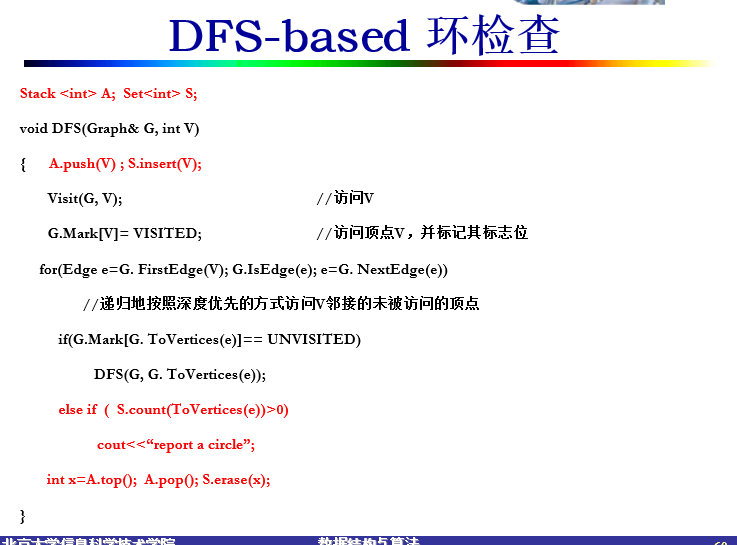

## bfs

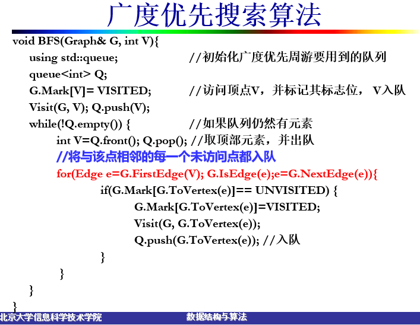

## 拓扑排序

- 先决条件：是指以某种线性顺序来组织多项任务，以便能够在满足先决条件的情况下逐个完成各项任务
- 有向无环图能够模拟先决条件

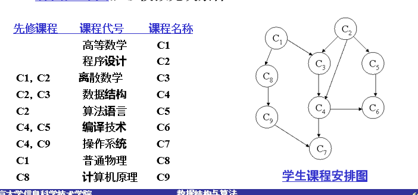

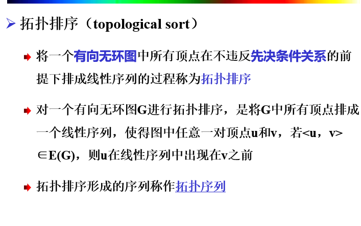

- `拓扑排序`显然不唯一

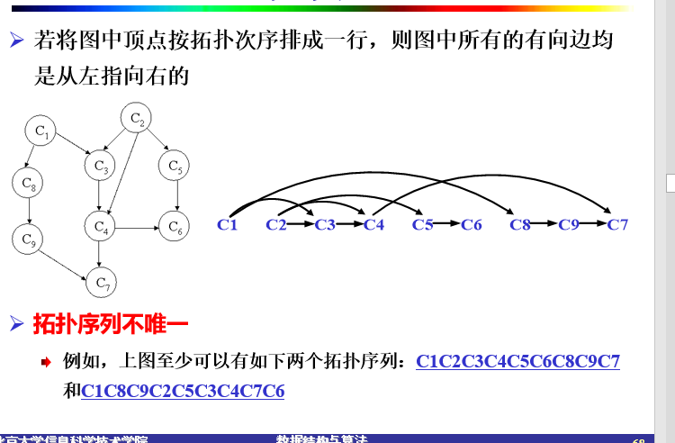

- `环存在时`不存在拓扑序列

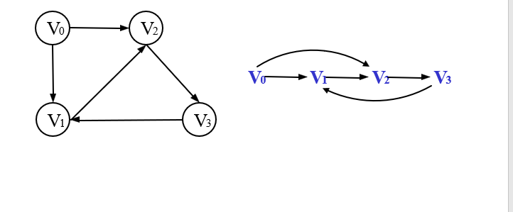

### 拓扑排序方法

- 从图中选择一个入度为0的顶点并输出
- 从图中删掉此顶点及其所有的出边（出边关联顶点的入度减1）
- 回到第一步继续执行

`若环路存在`

- 排序结束，仍有顶点没有输出
- 但在剩下的图中找不到入度为0的顶点

#### 基于邻接矩阵表示的拓扑排序

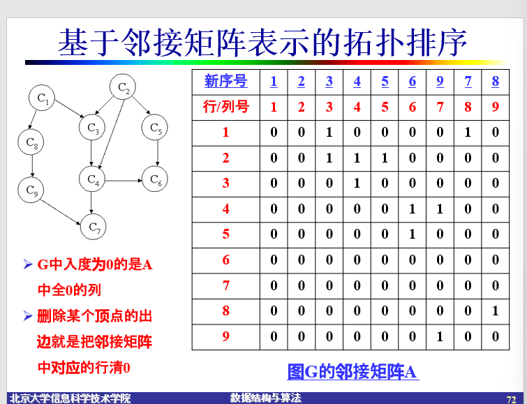

一个点的入度等于这个点所在的列的和

#### 基于邻接表的`bfs`算法

```cpp
void TopsortbyQueue(Graph &G)
{
    for (int i = 0; i < G.VerticesNum(); i++)
    {
        G.Mark[i] = UNVISITED;
    }
    using std::queue;
    queue<int> Q;
    for (i = 0; i < G.verticesNum(); i++)
    {
        // 图中入度为0的顶点入队
        if (G.Indegree[i] == 0)
        {
            Q.enqueue(i);
        }
    }
    while (!G.empty())
    {
        V = Q.dequeue();
        Visit(G, V);
        G.Mark[V] = VISITED;
        // 边的终点的入度值减1
        for (Edge e = G.FirstEdge(V); G.IsEdge(e); e = G.NextEdge(e))
        {
            G.Indegree[G.ToVertex(e)]--;
            if (G.Indegree[G.ToVertex(e)] == 0)
                Q.enqueue(G.ToVertex(e)); // 入度为0的顶点入队
        } // end for
    } // end while
    for (i = 0; i < G.VerticesNum(); i++)
    {
        if (G.Mark[i] == UNVISITED)
        {
            Print("图有环"); // 图有环
            break;
        }
    }
}
```

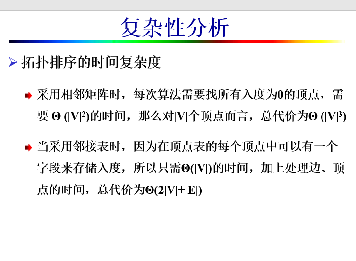

#### 基于邻接表的`dfs-topsort`算法

原理：假设在DAG中有一条有向路径从$v_i$到$v_j$，根据拓扑排序的规则，$v_i$一定排在$v_j$之前。在DFS中利用类似后序访问的规则，当$v_i$所有可以达到的节点被访问完以后，$v_i$才会被访问，这样节点被访问的顺序，恰好是拓扑排序的逆序。

```cpp
void TopsortbyDFS(Graph& G){//深度优先拓扑排序，结果逆序
    for(int i=0;i<G.VerticesNum();i++){//初始化标志位
        G.Mark[i]=UNVISITED;
    }
    int *result=new int[G.VerticesNum()];//最终输出的逆序结果
    int tag=0;
    for(i=0;i<G.VerticeNum();i++){
        //对图的所有顶点进行处理
        if(G.Mark[i]==UNVISITED){
            Do_topsort(G,i,result,tag);//调用递归函数

        }
        for(i=G.VerticesNum()-1;i>=0;i--){
            //逆序输出
            Visit(G,result[i]);
        }
    }
}
void Do_topsort(Graph& G,int V,int*result,int& tag){
    G.Mark[V]=VISITED;
    for(Edge e=G.FirstEdge(V);G.IsEdge(e);e=G.NextEdge(e)){
        if(G.Mark[G.ToVertex(e)]==UNVISITED){
            Do_topsort(G,G.ToVertex(e),result,tag);//递归调用
        }
    }
    result[tag++]=V;
}
```

==注意==：深度优先拓扑排序不能判断环的存在

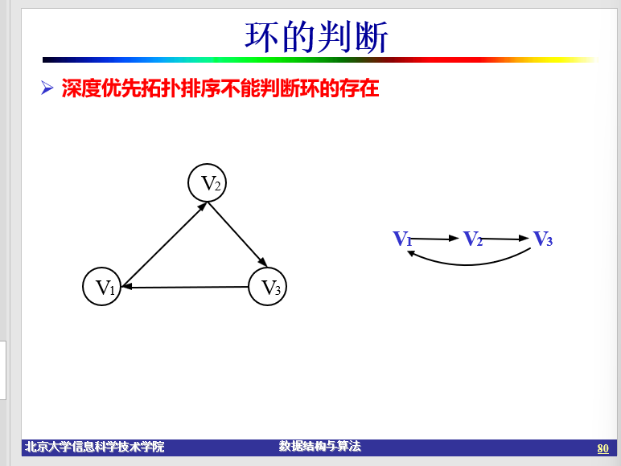

`思考题`:**给出一种实现判断深度优先拓扑排序环存在的算法！**

给edge加上一个标志位，在

```cpp
void Do_topsort(Graph& G,int V,int*result,int& tag){
    G.Mark[V]=VISITED;
    for(Edge e=G.FirstEdge(V);G.IsEdge(e);e=G.NextEdge(e)){
        if(G.Mark[G.ToVertex(e)]==UNVISITED){
            //同时e.Mark=VISITED;
            Do_topsort(G,G.ToVertex(e),result,tag);//递归调用
        }
    }
    //这里加上判断V的各个边是否都被访问的判断
    result[tag++]=V;
}
```

## 最短路径问题

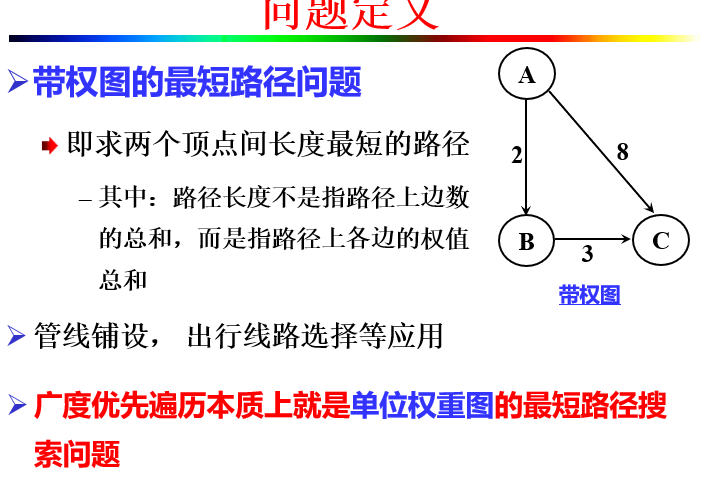

`分类`

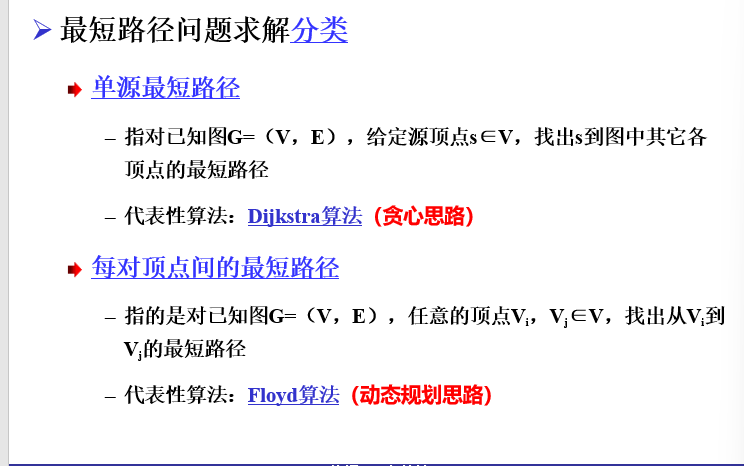

### 单源最短路径(`Dijkstra算法`)

注意：*边权非负*

基本思想：

- 每次从距离**已生成最短路径的节点集合**“*一步之遥*”的节点中，选择距离远点$V_0$最近的边进行延伸
- 结果由近到远以起始点$V_0$为根的有向树

**贪心算法**

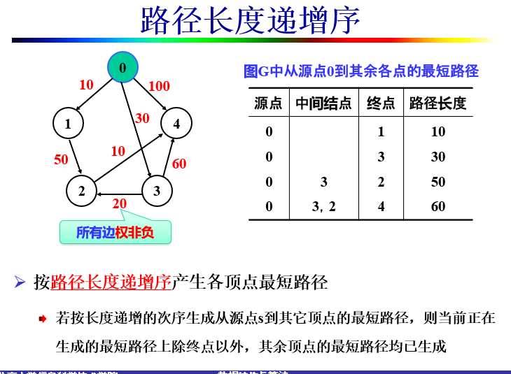

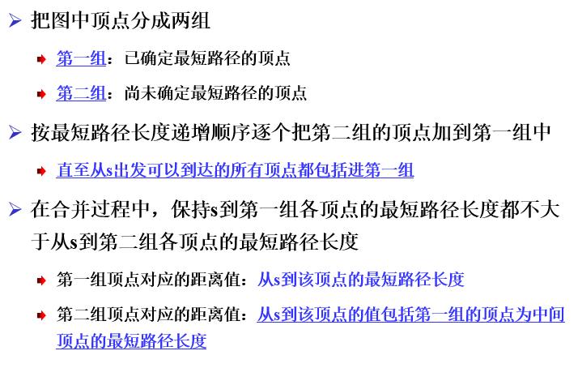

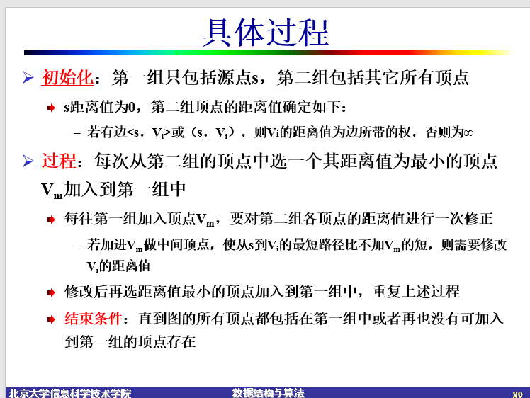

最短路径的表示方法：

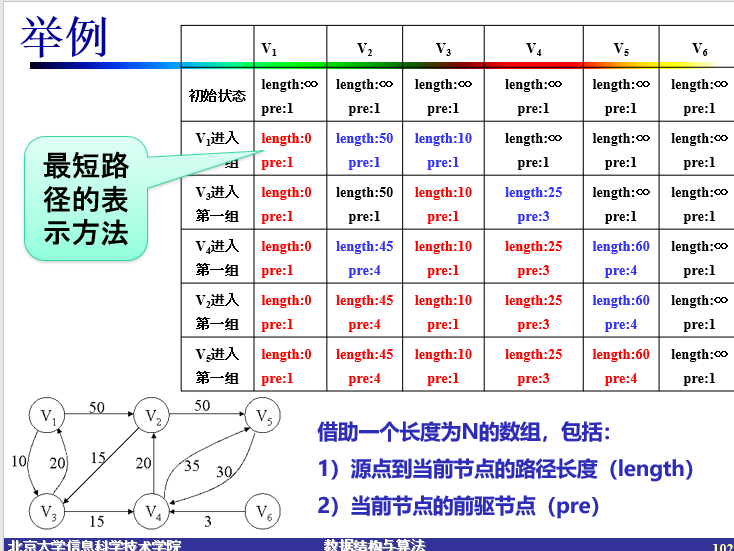

实现：

```cpp
class Dist { // Dist类，Dijkstra和Floyd算法用于保存最短路径信息
public:
    int index;   // 顶点的索引值，仅Dijkstra算法用到
    int length;  // 当前最短路径长度
    int pre;     // 路径最后经过的顶点
};

void Dijkstra(Graph& G, int s, Dist* &D) {
    D = new Dist[G.VerticesNum()];

    // 初始化Mark数组、D数组
    for (int i = 0; i < G.VerticesNum(); i++) {
        G.Mark[i] = UNVISITED;
        D[i].length = INFINITY;//无穷
        D[i].index = i;//顶点的索引值
        D[i].pre = s;
    }

    D[s].length = 0;                        // 源点为s；
    MinHeap<Dist> H(G.EdgesNum());           // 声明一个最小值堆；
    H.Insert(D[s]);                          // 以源点s初始化堆；

    for (int i = 0; i < G.VerticesNum(); i++) {
        bool FOUND = false;
        Dist d;

        // 找下一个最短路径顶点
        while (!H.empty()) {
            d = H.RemoveMin();
            if (G.Mark[d.index] == UNVISITED) {
                FOUND = true;
                break;                        // 把该点加入已访问组；
            }
        }

        if (!FOUND) break;
        int v = d.index;
        G.Mark[v] = VISITED;
        Visit(v);                             // 打印输出；

        for (Edge e = G.FirstEdge(v); G.IsEdge(e); e = G.NextEdge(e)) {
            if (D[G.ToVertex(e)].length > D[v].length + G.Weight(e)) {
                D[G.ToVertex(e)].length = D[v].length + G.Weight(e);
                D[G.ToVertex(e)].pre = v;
                H.insert(D[G.ToVertex(e)]);    // 入堆；
            }
        }
    }
}

```

时间复杂性：


### `Floyd算法`


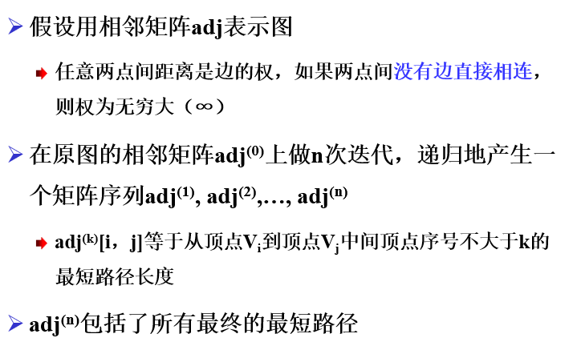

基本思想:

- 从任意节点A到任意节点B的最短路径不外乎2种可能，1是直接从A到B，2是从A经过若干个节点X到B。

#### 递推公式

- 假设已求得矩阵$adj^{(k-1)}$，那么从顶点$V_i$到顶点$V_j$中间顶点的序号不大于k的路径有两种情况：
  - 中间不经过顶点$V_k$,那么$adj^{(k)}[i,j]=adj^{(k-1)}[i,j]$
  - 中间经过顶点$V_k$，那么$adj^{(k)}[i,j]<adj^{(k-1)}[i,j]，且adj^{(k)}[i,j]=adj^{(k-1)}[i,k]+adj^{(k-1)}[k,j]$

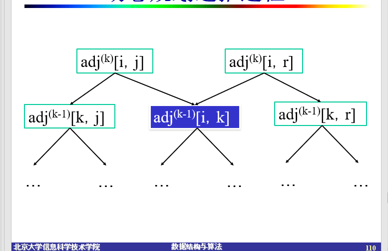


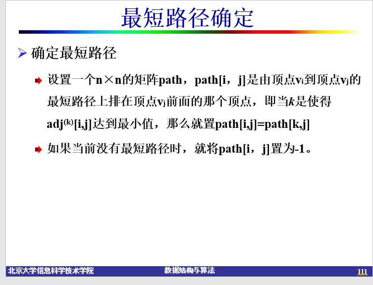

这一页的解释

>在这一页幻灯片中，描述了如何确定最短路径的具体方法：
>
>1. **使用路径矩阵 `path`**：
>   - 定义一个 \( $n \times n$ \) 的矩阵 `path`，其中 `path[i][j]` 表示从顶点 \($ v_i $) 到顶点 \( $v_j$ \) 的最短路径上紧接在 \( $v_j$ \) 之前的那个顶点。
>   - 这个矩阵在更新过程中会逐步填充，记录路径中的前驱顶点。
>
>2. **路径更新规则**：
>   - 如果在迭代过程中找到一个新的路径，使得从 $( v_i ) 到 ( v_j )$ 的距离更小，那么更新 `path[i][j]` 为使得距离最小的中间顶点 `k` 的前驱，即 `path[i][j] = path[k][j]`。
>
>3. **无路径情况**：
>   - 如果当前没有从 \( v_i \) 到 \( v_j \) 的路径，则将 `path[i][j]` 置为 -1。
>
>这页主要说明了在求最短路径时如何使用路径矩阵来追踪路径信息，以便在计算出最短路径长度的同时，也可以获得具体的路径序列。

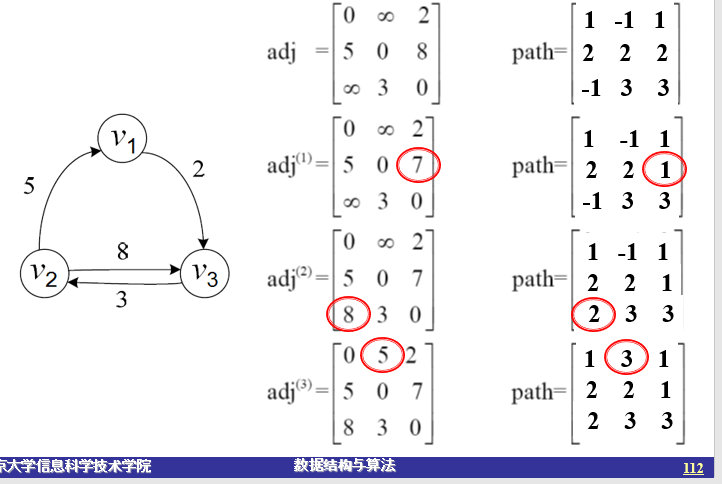

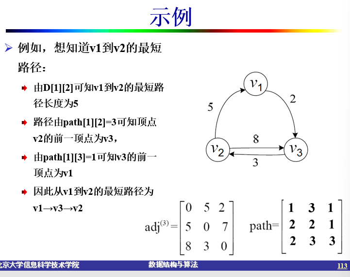

提取并合并的 Floyd 算法实现代码如下：

```cpp
void Floyd(Graph& G, Dist** &D) {
    int i, j, v;
    D = new Dist*[G.VerticesNum()];

    // 申请数据D的空间
    for (i = 0; i < G.VerticesNum(); i++) {
        D[i] = new Dist[G.VerticesNum()];

        // 初始化D数组
        for (j = 0; j < G.VerticesNum(); j++) {
            if (i == j) {
                D[i][j].length = 0;    // 权值矩阵
                D[i][j].pre = i;       // path矩阵
            } else {
                D[i][j].length = INFINITY;
                D[i][j].pre = -1;
            }
        }
    }

    // 矩阵初始化，仅初始化邻接顶点
    for (v = 0; v < G.VerticesNum(); v++) {
        for (Edge e = G.FirstEdge(v); G.IsEdge(e); e = G.NextEdge(e)) {
            D[v][G.ToVertex(e)].length = G.Weight(e);
            D[v][G.ToVertex(e)].pre = v;
        }
    }

    // 权值、路径更新
    for (v = 0; v < G.VerticesNum(); v++) {
        for (i = 0; i < G.VerticesNum(); i++) {
            for (j = 0; j < G.VerticesNum(); j++) {
                if (D[i][v].length + D[v][j].length < D[i][j].length) {
                    D[i][j].length = D[i][v].length + D[v][j].length;
                    D[i][j].pre = D[v][j].pre;
                }
            }
        }
    }
}
```

#### 代码说明

1. **初始化 `D` 数组**：
   - 为 `D` 分配空间，并初始化每个顶点到自身的距离为 0，路径前驱为自身。
   - 如果顶点之间没有直接边，则设置距离为无穷大，前驱为 -1。

2. **邻接顶点的初始化**：
   - 仅初始化有直接连接的邻接顶点的距离和前驱。

3. **权值、路径更新**：
   - 通过三重循环更新 `D` 数组。对于每一对顶点 \(i\) 和 \(j\)，检查是否可以通过中间顶点 \(v\) 找到更短路径，如果可以则更新距离和前驱。

#### 时间复杂度

此算法的时间复杂度为 \(O(n^3)\)，适合稠密图。

## 最小支撑（生成）树

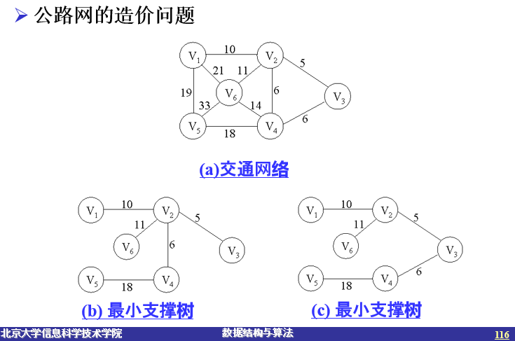

概念：

- 最小支撑树（**M**inimum-cost **S**panning **T**ree,MST）
  - 对于带权的连通无向图G，其最小支撑树是一个包括G的所有顶点和部分边的图，这部分边满足下列条件：
    - 保证图的连通性
    - 边权值总和最小

- 代表算法：
  - Prim算法
  - Kruskal算法


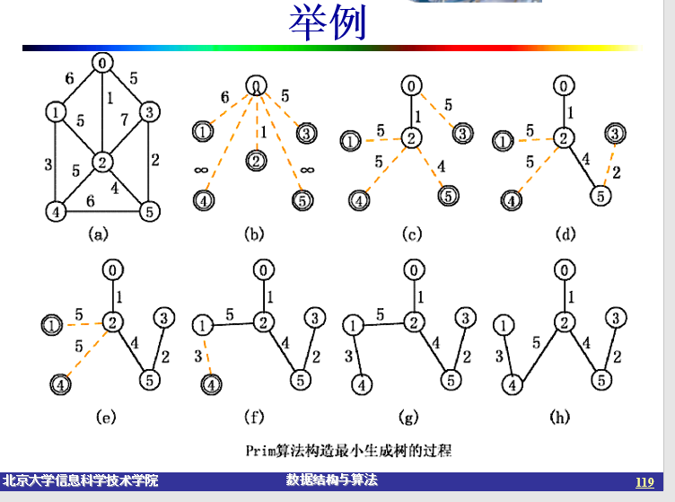

提取并合并的 Prim 算法实现代码如下：

```cpp
void Prim(Graph& G, int s, Edge* &MST) {
    int MSTtag = 0;                                // 最小支撑树边的标号
    Edge* MST = new Edge[G.VerticesNum() - 1];
    MinHeap<Edge> H(G.EdgesNum());

    // 初始化Mark数组
    for (int i = 0; i < G.VerticesNum(); i++) {
        G.Mark[i] = UNVISITED;
    }

    int v = s;
    G.Mark[v] = VISITED;                           // 开始顶点首先被标记

    do {
        // 将v为顶点，另一顶点未被标记的边插入最小值堆H
        for (Edge e = G.FirstEdge(v); G.IsEdge(e); e = G.NextEdge(e)) {
            if (G.Mark[G.ToVertex(e)] == UNVISITED) {
                H.Insert(e);
            }
        }

        bool Found = false;
        Edge e;

        // 寻找下一条权最小的边
        while (!H.empty()) {
            e = H.RemoveMin();
            if (G.Mark[G.ToVertex(e)] == UNVISITED) {
                Found = true;
                break;
            }
        }

        if (!Found) {
            Print("不存在最小支撑树。");
            delete[] MST;                          // 释放空间
            MST = NULL;                            // MST是空数组
            return;
        }

        v = G.ToVertex(e);
        G.Mark[v] = VISITED;                       // 在顶点v的标志位上做已访问的标记
        AddEdgetoMST(e, MST, MSTtag++);            // 将边e加到MST中
    } while (MSTtag < (G.VerticesNum() - 1));
}
```

#### 代码说明

1. **初始化**：
   - 定义最小支撑树的边集合 `MST`，以及最小堆 `H`。
   - 初始化所有顶点为未访问状态，并设置起始顶点 `v` 为已访问。

2. **构建最小支撑树**：
   - 将 `v` 连接的、另一端未访问的边加入到最小堆 `H` 中。
   - 从堆中选出权值最小且另一端未被访问的边 `e`，将该边的终点设为已访问，并将该边加入 `MST`。

3. **边检查**：
   - 如果无法找到满足条件的边，说明不存在最小支撑树，释放 `MST` 空间并退出。

4. **循环终止条件**：
   - 重复上述步骤直到 `MST` 包含 `V-1` 条边，即构成最小支撑树。

该代码实现了以最小堆优化的 Prim 算法，适用于稠密图。

#### 证明Prim算法的正确星

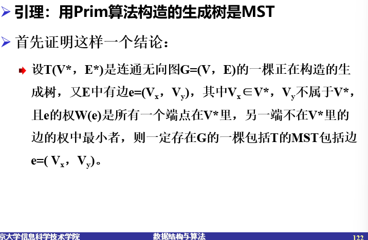

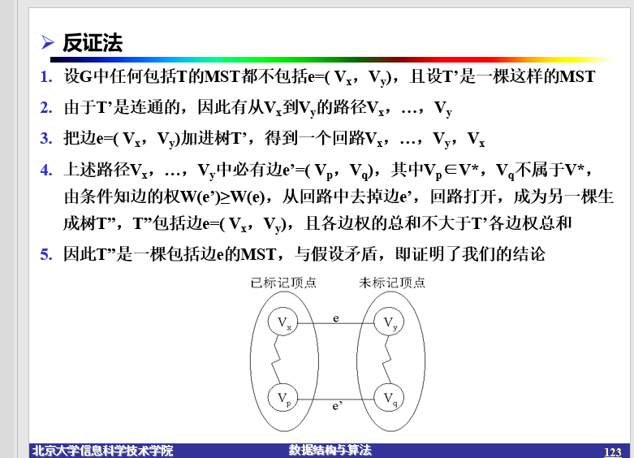


### `Kruskal`算法

基本思想

- 对于图G=（V，E）开始时，将顶点集分为|V|个等价类，每个等价类包括一个顶点
- 然后，以权的代销为顺序处理各条边，如果某条边连接两个不同等价类的顶点，则这条边被合并为一个：
- 反复执行此过程，直到剩下一个等价类

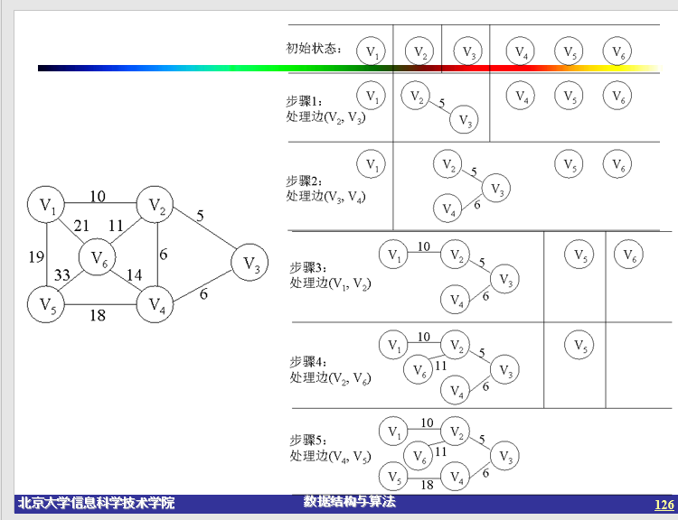

提取并合并的 Kruskal 算法实现代码如下：

```cpp
void Kruskal(Graph& G, Edge* &MST) {
    Partree A(G.VerticesNum());                // 等价类
    MinHeap<Edge> H(G.EdgesNum());             // 声明一个最小堆
    MST = new Edge[G.VerticesNum() - 1];       // 最小支撑树
    int MSTtag = 0;                            // 最小支撑树边的标号

    // 将图的所有边插入最小值堆H中
    for (int i = 0; i < G.VerticesNum(); i++) {
        for (Edge e = G.FirstEdge(i); G.IsEdge(e); e = G.NextEdge(e)) {
            if (G.FromVertex(e) < G.ToVertex(e)) {
                H.Insert(e);
            }
        }
    }

    int EquNum = G.VerticesNum();              // 开始时有|V|个等价类

    // 合并等价类
    while (EquNum > 1) {
        Edge e = H.RemoveMin();                // 获得下一条权最小的边
        int from = G.FromVertex(e);            // 记录该条边的信息
        int to = G.ToVertex(e);

        if (A.differ(from, to)) {              // 如果边e的两个顶点不在一个等价类
            A.UNION(from, to);                 // 将边e的两个顶点所在的两个等价类合并为一个
            AddEdgetoMST(e, MST, MSTtag++);    // 将边e加到MST中
            EquNum--;                          // 将等价类的个数减1
        }
    }
}
```

#### 代码说明

1. **初始化**：
   - 创建等价类 `A` 用于管理顶点的联通性，使用最小堆 `H` 来保存边，并初始化最小生成树 `MST`。

2. **边集合入堆**：
   - 遍历图的所有边，将每条边插入最小堆 `H` 中，确保只插入每条边一次。

3. **合并等价类**：
   - 从堆中提取权值最小的边 `e`，判断其两端点是否属于不同的等价类。
   - 如果是不同的等价类，合并它们并将边加入 `MST`。
   - 减少等价类的数量，直到只剩一个连通分量，即构成最小生成树。

Kruskal 算法通过最小堆和等价类合并实现，适用于稀疏图。


