[TOC]

# 第一节：引言+概论

- 课程目录

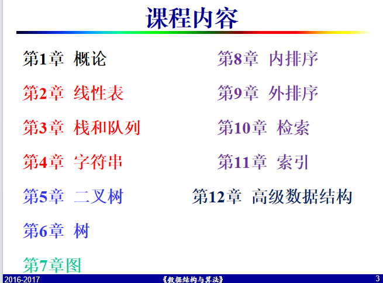

## 解决问题的过程

- 问题
  - 从输入到输出的一种映射函数
- 数据结构
  - 数据的逻辑结果及在计算机中的存储表达，支持相应操作
- 算法
  - 对特定问题求解过程的描述方法
- 程序
  - 算法在计算机程序设计语言中的实现

## 课程地位

承上启下

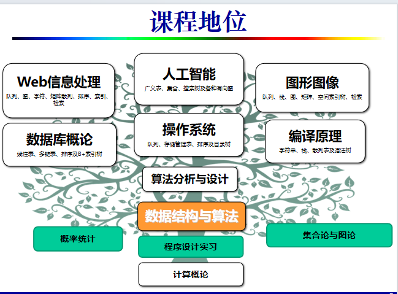

# 考核情况

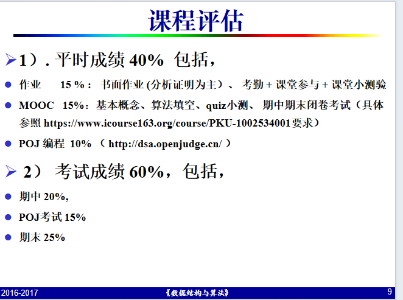

# 教材

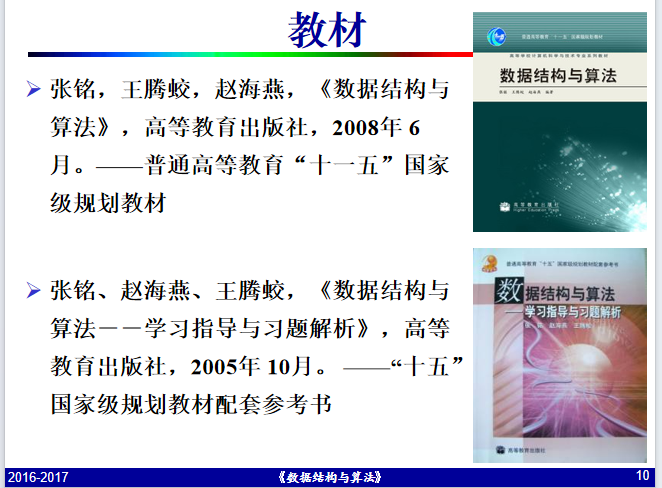

## 数据结构

- 涉及数据之间的逻辑关系、数据在计算机中的`存储表示`和在这种结构上的一组能执行的`操作(运算)`三个方面

三要素

- 逻辑结构
- 存储（物理）结构
- 运算

### 逻辑结构

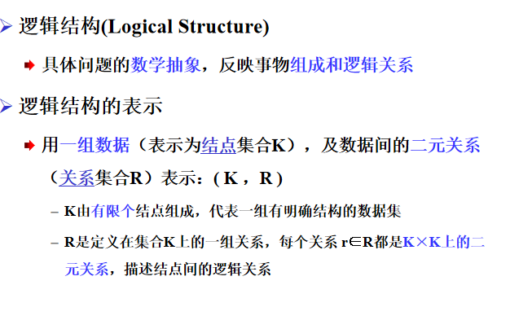

#### 举例

1. 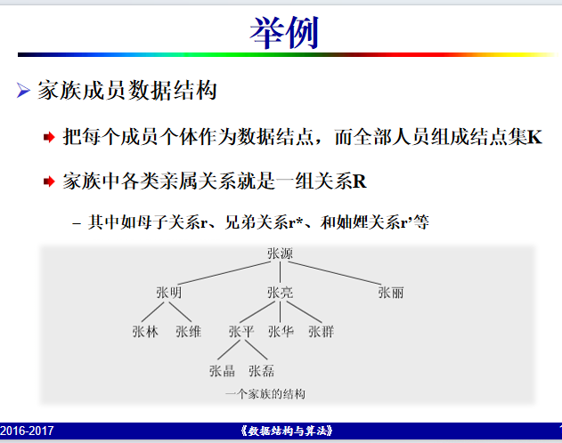

### 节点类型

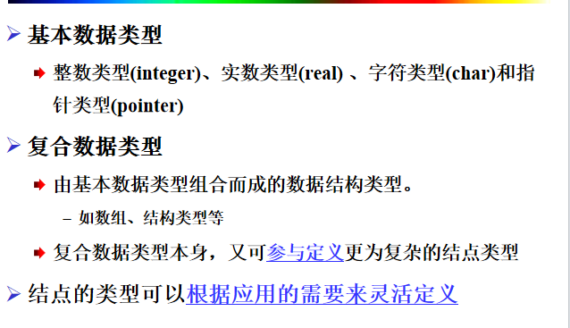

### 结构（关系）分类

- 用R的性质来刻画数据结构的特点，并进行分类
  - 线性结构
  - 树形结构
  - 图结构

#### 线性结构

- 线性表(表，栈，队列，串等)

#### 非线性结构

- 树（二叉树等）
- 图

$$线性表\subseteq二叉树\subseteq树\subseteq图$$

### 线型结构

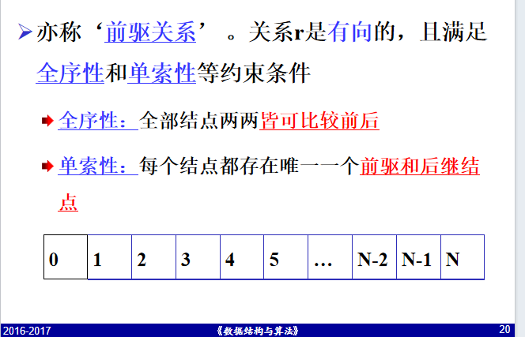

### 树型结构

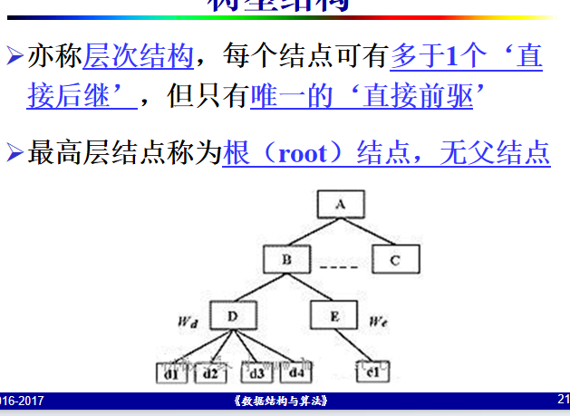

### 图型结构

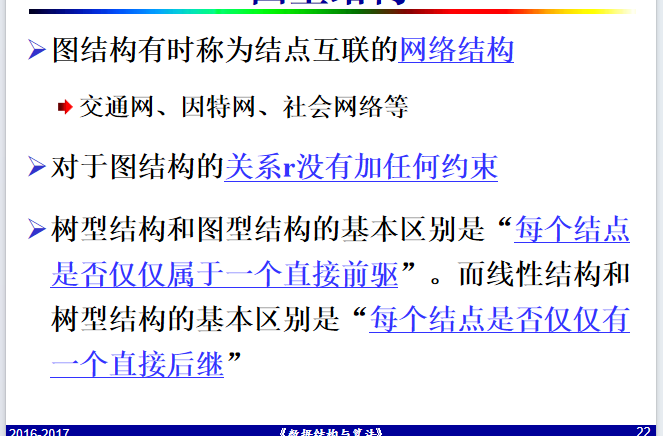

## 结点和结构（关系）

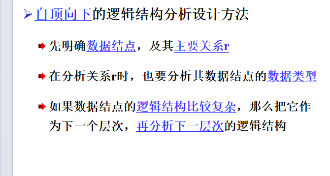

### 存储结构

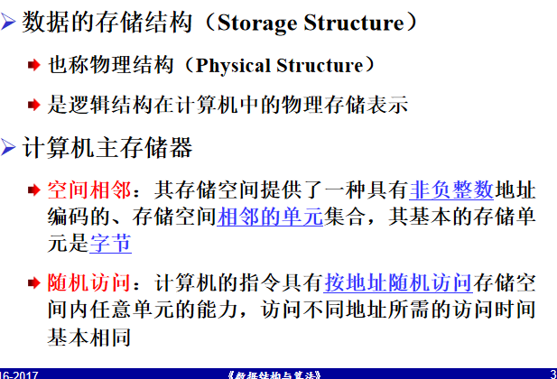

## 算法分类

- 穷举法——万能，低效
  - 避免穷举测试
- 回溯（迷宫、八皇后）、搜索（`DFS,BFS`）
  - 跳过无解分支，最优化问题的通法
- 贪心法
  - 最优子结构——最优解
  - 否则，只是快速打得到次优解
- 递归分治(二分探索、快速排序、分治排序)
  - 子结构不重复
  - 分、治、合
- 动态规划（Floyd算法）

———自底向上，利用中间结果，迅速构造

- 最优子结构、重复子结构、无后效性

- 搜索中分支定界的特例

- 空间换时间

  ​	