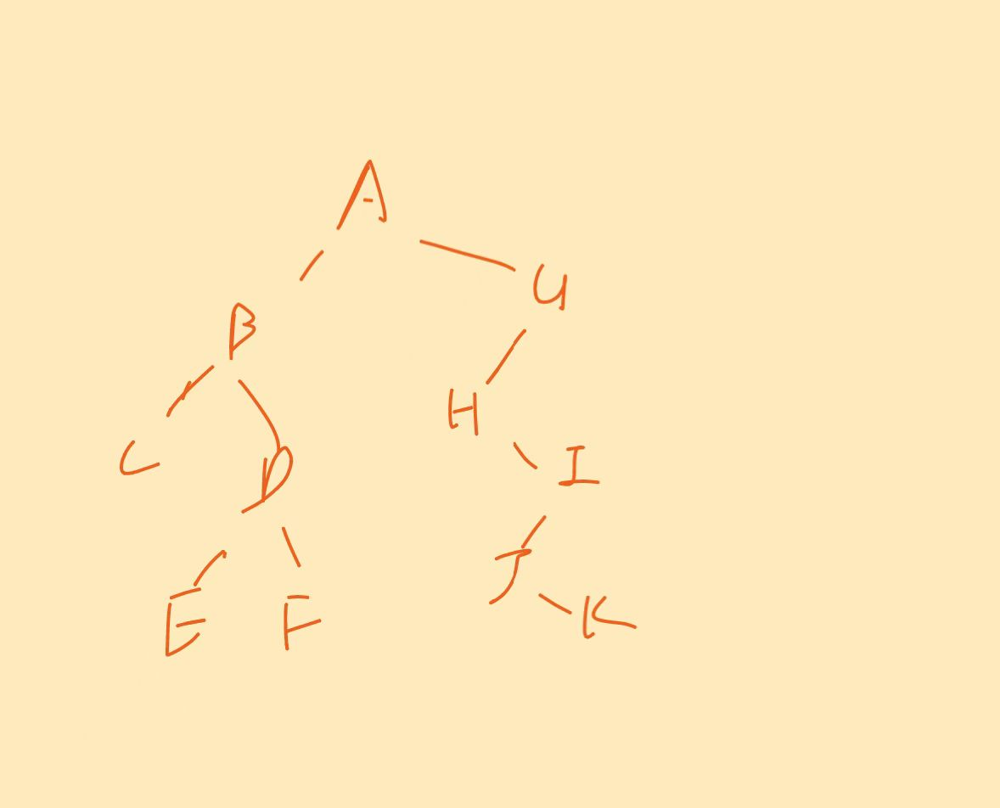

# 1

# 2

>证明：
>
>前序遍历：中 左 右
>
>中序遍历： 左 中 右
>
>后序遍历： 左 右 中
>
>- 当树为空时，显然成立
>- 当树只有一个节点时，也显然成立（该节点就是叶节点）
>
>**归纳假设**
>
>假设当为k（$$k\geq2$$）时，二叉树的所有终端结点(叶结点)，在前序序列、中序序列、后序序列中都按相同的相对位置出现。
>
>那当为k+1时
>
>- 对于前序遍历，我们访问根节点，再访问左子树，再访问右子树
>- 对于中序遍历，我们先访问左子树，再访问根节点，再访问右子树
>- 对于后序遍历，我们先访问左子树，再访问右子树，再访问根节点
>
>我们可以观察到，无论哪个遍历，都是左子树在右子树的前面，那么由于根节点不会是叶节点（指的是树根节点$$k\geq 2$$）
>
>那么我们可以得到：
>$$
>叶子结点的顺序=左子树叶子结点的顺序+右子树叶子结点的顺序
>$$
>由于左子树和右子树的节点数$$\leq k$$，那么得证！

# 3

## （1）

>叶节点数=内部节点数+1
>
>则 199=2*x-1
>
>x=100
>
>即该哈夫曼树叶节点数为100

## （2）

| 频率 | 编码    |
| ---- | ------- |
| 0.32 | 0       |
| 0.21 | 10      |
| 0.19 | 110     |
| 0.10 | 1110    |
| 0.07 | 11110   |
| 0.06 | 111111  |
| 0.03 | 1111101 |
| 0.02 | 1111100 |

## （3）

| 频率 | 编码 |
| ---- | ---- |
| 0.32 | 000  |
| 0.21 | 001  |
| 0.19 | 010  |
| 0.10 | 011  |
| 0.07 | 100  |
| 0.06 | 101  |
| 0.03 | 110  |
| 0.02 | 111  |

### 优缺点对比

- 哈夫曼编码所占用的空间是最少的，即
  $$
  \sum_{i=0}^{n-1}W_{i}l_{i}
  $$
  是最小的，$$W_{i}$$是权重，$$l_{i}$$是编码长度

  但生成和翻译哈夫曼编码的时间复杂度都较高

- 等长编码更容易解码

  但占用空间大

# 4

## （1）

### 第一步

### 最后图

最小值是67

## （2）

该最小堆的叶子结点

## （3）

- n个结点堆的高度为log n,第i层上的结点数最多为$$2^{i}(i\geq 0)$$

- 建堆过程中，每个飞叶子结点都调用一次SiftDown算法，而每次最多向下调整到最底层，即第I层上的结点向下调整到最底层的调整次数为log n -i.

- 建堆时间为
  $$
  \sum_{i=0}^{log\ n}2^{i}*(log\ n-i)\\
  令\ j=log\ n-i\\
  则\sum_{i=0}^{log\ n}2^{i}*(log\ n-i)=\sum_{i=0}^{log\ n}2^{log\ n-j}*j=\sum_{j=0}^{log\ n}n*\frac{j}{2^{j}}\\
  则C_{0}=\sum_{j=0}^{log\ n}\frac{j}{2^{j}}
  $$
  

# 5

首先将给定权值按从小到大排序。如果节点数n不满足$$n=1\ mod(k-1)$$，则需要添加$$s=(k-1)-((n-1)mod(k-1))$$个权值为0的虚拟节点，使得新的节点总数满足$$n^{'}=n+s=1\ mod(k-1)$$

构造过程：

- 重复以下步骤，直到剩下一个节点为止：
  - 从当前节点集合中选出权值最小的k个节点
  - 将这k个节点合并为一个新节点，新节点的权值为这k个节点取值之和
  - 将新节点放回节点集合中

三叉树：

WPL=1×4+4×4+9×3+16×3+25×2+36×2+49×2+64×2+81×2+100×1=4+16+27+48+50+72+98+128+162+100=705
