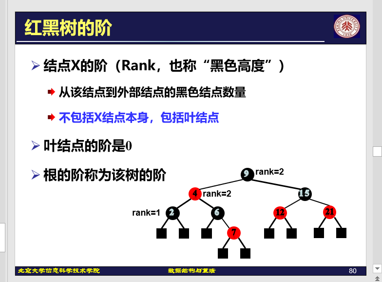
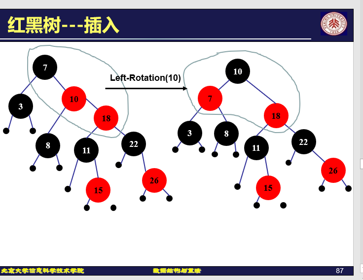

# 索引

## 定义介绍


```
主文件和索引文件在编程和数据管理中有不同的用途和功能：

主文件：

主文件通常包含主要的数据或代码。
在数据库中，主文件包含实际的数据记录。
在编程中，主文件可能是包含程序主要逻辑的文件，例如 main.py 或 index.js。
索引文件：

索引文件用于加速数据检索。
在数据库中，索引文件包含指向主文件中数据记录的指针，以便快速查找。
在编程中，索引文件可能是用于导入和组织其他模块或文件的文件，例如 index.html 或 index.js。
```


## 线性索引


>
>
>在检索时，线性索引文件并不被读入内存，被读入内存的是二级线性索引文件 
>
>由于二级索引往往存储在内存，通常只需要访问两次磁盘即可：一次读入线性索引文件，一次读入数据库记录

## 静态索引


## 倒排索引


### 对正文文件的倒排


#### 词索引


## 动态索引

### B树

- 文件创建时生成
- 结构随着插入、删除等操作而改变
- 保持最佳的检索性能


>
>
>两个节点之间插入一个关键码


>
>
>节点不一定在内存中(B树一般很大)


## B+树

- 在叶节点上存储信息的上、
- 各层节点中的关键码均是下一层相应节点中最大关键码的复写


父节点是子节点最大值的拷贝

关键码都在叶子结点处

叶子结点有双向链表是为了方便范围查询，例如查($30\leq age \leq 70$)

### 差异


## B树性能分析


## 红黑树

 ### 定义

本质是自平衡二叉搜索树





## 旋转


>
>
>一开始当红色插入（避免和其他的子节点到根节点的黑色节点数目不同）





>
>
>两红顶一黑变成两黑顶一红
>
>让红红冲突向上迭代两层


>
>
>这是把case2变成case 3


### 删除

### 普通二叉搜索树


### 红黑树删除

